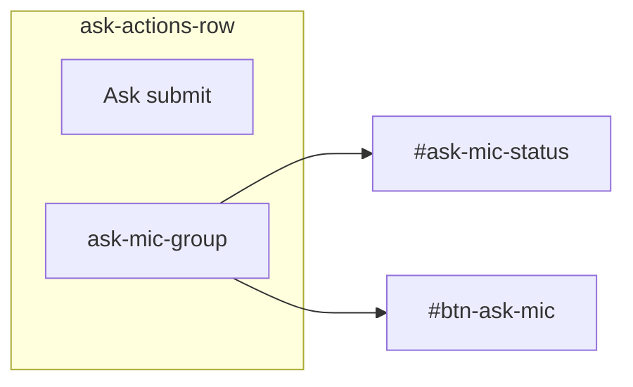

# Ask tab: Speak + Ask on one row (desktop)

## Current layout

In [`static/index.html`](static/index.html), `#form-ask` is ordered:

1. Question textarea
2. `.ask-mic-row` — **Speak question** + `#ask-mic-status`
3. Optional document `<details>`
4. **Ask** submit button

The mic sits directly under the textarea; Ask is alone on a later line. On a wide screen the card feels underused and the primary actions are split.

```1000:1015:static/index.html
<form id="form-ask">
  ...
  <div class="ask-mic-row">
    <button type="button" id="btn-ask-mic">Speak question</button>
    <span id="ask-mic-status" class="field-hint" hidden>Listening…</span>
  </div>
  <details class="ingest-text-details">...</details>
  <button type="submit">Ask</button>
</form>
```

Mic JS binds by `#btn-ask-mic` / `#ask-mic-status` IDs — **no JS changes needed** if those IDs stay on the same elements.

## Target layout (desktop)



- **Left:** Ask (primary submit, unchanged styling)
- **Right:** Speak question + inline Listening status when active
- Optional document filter stays **above** the action row (unchanged order relative to submit)

## Implementation

**File:** [`static/index.html`](static/index.html) only

### 1. HTML — replace `.ask-mic-row` + lone submit with one action row

Remove the standalone `.ask-mic-row` block and the separate submit button. After the document `<details>`, add:

```html
<div class="ask-actions-row">
  <button type="submit">Ask</button>
  <div class="ask-mic-group">
    <span id="ask-mic-status" class="field-hint" hidden>Listening…</span>
    <button type="button" id="btn-ask-mic">Speak question</button>
  </div>
</div>
```

Status before mic keeps “Listening…” text immediately left of the button on the right side.

### 2. CSS — desktop row with mic pinned right

Replace `.ask-mic-row` rules (~line 736) with:

```css
.ask-actions-row {
  display: flex;
  flex-wrap: wrap;
  align-items: center;
  gap: 0.75rem;
  margin-top: 0.25rem;
}
.ask-mic-group {
  display: flex;
  flex-wrap: wrap;
  align-items: center;
  gap: 0.75rem;
}
.ask-mic-group .field-hint {
  margin: 0;
}
```

Desktop breakpoint (full-width within the 720px `.layout` container):

```css
@media (min-width: 600px) {
  .ask-actions-row {
    justify-content: space-between;
  }
  .ask-mic-group {
    margin-left: auto;
  }
}
```

Below 600px: both controls stay in `.ask-actions-row` but stack/wrap naturally (Ask first, mic group below) — avoids cramming two wide easy-ui buttons (48px min-height) on very narrow phones.

Optional polish (only if needed after visual check): give `#btn-ask-mic` the same secondary button treatment as other `button[type="button"]` controls in the form (border, surface background) so it visually pairs with Ask without competing as primary.

### 3. No other changes

- Mic idle/safety logic (`bindAskMic`, `setTab` cleanup) unchanged — same element IDs
- `body.easy-ui #btn-ask-mic` sizing rule stays valid
- No backend or help copy updates required

## Manual check

1. Desktop (≥600px): open **Ask** → **Ask** left, **Speak question** flush right on one row; optional doc filter above
2. Click **Speak question** → “Listening…” appears beside the mic on the right; stop/cancel still resets label
3. Narrow viewport (&lt;600px) → action row wraps without overlap
4. Preset chip auto-submit and typed question + **Ask** still work
