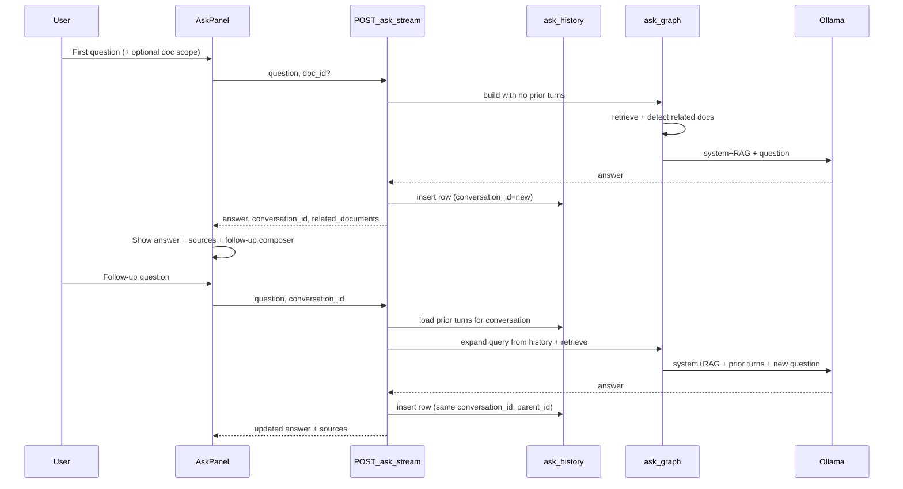

# Conversational Ask with optional document scope

## Current state

Ask is **single-turn only**:

- [`AskRequest`](app/models.py) has `question` + optional `doc_id` / `tag` scope — no `conversation_id` or prior turns.
- [`build_prompt_and_chunks()`](app/ask_graph.py) embeds only the current question and builds one flat prompt string.
- [`llm_client.answer_with_context()`](app/llm_client.py) sends a single `{role: user}` message to Ollama.
- [`ask_history`](supabase/migrations/20250617120000_ask_history.sql) stores flat Q&A rows; the UI renders them as independent `<details>` items in [`static/index.html`](static/index.html).
- Related-document logic exists only for mortgage topics in [`ask_retrieval_boost.py`](app/ask_retrieval_boost.py); `top_chunks` are returned by the API but not shown prominently in the UI.

## Target UX (extend current UI)

Keep the existing Ask form and answer area. After an answer completes:

1. Show a short **sources line** under the answer when documents were used (pinned by user or detected by retrieval).
2. Reveal a **follow-up row**: small textarea + “Ask follow-up” button (doc scope dropdown stays visible and carries forward).
3. Submitting a follow-up keeps the same `conversation_id`, shows the new answer in the main answer area, and appends to grouped history.
4. **Previous questions** groups follow-ups under the first question in each thread (nested `<details>`), with a “New conversation” control to reset.



## Backend design

### 1. Extend `ask_history` schema

Add columns via new migration + mirror in [`app/db.py`](app/db.py) / [`app/db_postgres.py`](app/db_postgres.py):

| Column | Purpose |
|--------|---------|
| `conversation_id` | Groups a thread of Q&As |
| `parent_id` | `NULL` for first turn; points to prior row for follow-ups |
| `related_docs_json` | `[{doc_id, title, reason}]` for UI source badges |
| `top_chunks_json` | Optional; persist retrieved chunks for history replay |

Retention: keep existing 100-row prune but **prune by conversation** (drop oldest whole conversations, not arbitrary rows) so threads stay intact.

### 2. Extend API models

In [`app/models.py`](app/models.py):

```python
class RelatedDocument(BaseModel):
    doc_id: str
    title: str
    reason: Literal["pinned", "retrieved", "topic_boost"]

class AskRequest(BaseModel):
    question: str
    conversation_id: str | None = None  # omit = new conversation
    # existing: top_k, doc_id, doc_ids, tag, use_rag

class AskResponse(BaseModel):
    # existing fields...
    conversation_id: str
    turn_id: str  # this row's ask_history id
    related_documents: list[RelatedDocument] = []
```

Update [`AskHistoryItem`](app/models.py) and [`fetch_ask_history()`](app/ask_history.py) to return grouped thread metadata (`conversation_id`, `parent_id`, `related_documents`).

New endpoint (optional but useful for page reload):

- `GET /ask/conversations/{conversation_id}` — load full thread for restoring follow-up state.

### 3. Conversation context loading

New module [`app/ask_conversation.py`](app/ask_conversation.py):

- `load_conversation_turns(conn, conversation_id, max_turns=6)` → list of `{role, content}` pairs.
- `resolve_doc_scope(ask_request, prior_turns, conn)`:
  - Explicit `doc_id` / `tag` on request wins.
  - Else inherit `doc_filter` from the conversation’s first turn.
  - Else no scope (search all docs).

### 4. Smarter retrieval on follow-ups

In [`ask_graph.py`](app/ask_graph.py):

- **`expand_retrieval_query(question, prior_turns)`** — for follow-ups, embed a standalone query built from the last user question + new question (cheap MVP; no extra LLM call). Example: `"CD maturity date | What about the interest rate?"`.
- Pass expanded query to [`retrieve_top_k()`](app/retrieval.py) instead of raw follow-up text when `prior_turns` is non-empty.
- Re-run retrieval every turn (do not freeze chunks from turn 1) so new follow-ups can pull different excerpts.

### 5. Related-document detection

New helper in [`app/ask_retrieval_boost.py`](app/ask_retrieval_boost.py) or a small [`app/ask_sources.py`](app/ask_sources.py):

1. **Pinned** — user set `doc_id` / `tag` → mark matching docs as `reason: "pinned"`.
2. **Retrieved** — group `top_chunks` by `doc_id`; include docs whose best chunk score exceeds a threshold (e.g. top 3 distinct docs).
3. **Topic boost** — docs from existing `related_doc_ids_for_question()` → `reason: "topic_boost"`.

Lookup titles via existing `GET /documents` DB helpers.

Update `_build_rag_prompt()` system instruction:

> If you used specific documents, briefly name them at the start (e.g. “Based on your CD maturity letter…”). If the user pinned a document, treat it as the primary source.

Return `related_documents` in API response regardless of whether the model mentions them (UI shows badges either way).

### 6. Multi-turn LLM calls

Extend [`app/llm_client.py`](app/llm_client.py):

```python
async def answer_with_messages(messages: list[dict]) -> str
async def answer_with_messages_stream(messages) -> AsyncIterator[str]
```

Message shape for RAG turns:

- **System**: Ledgerly instructions + layer2 summary + document excerpts + format suffix.
- **Prior turns**: alternating user / assistant from conversation history (truncate to ~4–6 turns or token budget).
- **Final user**: current question.

Keep existing single-string helpers as thin wrappers for backward compatibility.

Wire through [`main.py`](app/main.py) `/ask`, `/ask/stream`, and [`ask_worker.py`](app/ask_worker.py) queued path.

### 7. History persistence updates

Update [`insert_complete_answer()`](app/ask_history.py) / pending insert to:

- Generate `conversation_id` on first turn if not provided.
- Set `parent_id` to the last turn in the conversation when follow-up.
- Store `related_docs_json` and optionally `top_chunks_json`.

Update `GET /ask/history` to return items sorted for UI grouping (by `conversation_id`, then turn order).

## Frontend design ([`static/index.html`](static/index.html))

### State

```javascript
var activeConversationId = null;
var activeTurnId = null;
```

Set from API response after each successful ask.

### After answer renders

- Under `#ask-answer-md`, add `#ask-sources` — render chips from `related_documents` (title + reason tooltip).
- Show `#ask-followup-block` (hidden on fresh “New conversation”):
  - Textarea `#ask-followup-question`
  - Button “Ask follow-up”
  - Hint: “Follow-ups use the same document scope unless you change the dropdown above.”

### Submit logic

- First question: `{ question, doc_id?, tag? }` — no `conversation_id`.
- Follow-up: `{ question, conversation_id: activeConversationId, doc_id?, tag? }`.
- Do **not** clear the main question textarea on follow-up submit; only clear the follow-up field.
- “New conversation” button clears `activeConversationId`, hides follow-up block, clears answer.

### History grouping

Change `renderAskHistoryItem()`:

- Group rows by `conversation_id`.
- First turn = outer `<details>` summary (original question + date).
- Follow-ups = nested `<details>` or indented list inside the body.
- Clicking a history thread sets `activeConversationId` and shows its latest answer + follow-up composer.

### Streaming / queued jobs

Include `conversation_id` and `related_documents` in the NDJSON tail and job result payload so both paths behave the same.

## Files to touch

| Area | Files |
|------|-------|
| Schema | `supabase/migrations/20250618*_ask_conversations.sql`, `app/db.py`, `app/db_postgres.py` |
| Models / API | `app/models.py`, `app/main.py`, `app/ask_worker.py` |
| Ask pipeline | `app/ask_graph.py`, `app/ask_conversation.py` (new), `app/ask_sources.py` (new), `app/llm_client.py` |
| History | `app/ask_history.py` |
| UI | `static/index.html`, optionally `static/help.html` (one paragraph on follow-ups) |
| Tests | `tests/test_ask_conversation.py` (new), extend `tests/test_ask_history.py` |

## Testing plan

- **Unit**: query expansion produces usable retrieval string for pronoun-style follow-ups (“What about the rate?” after a CD question).
- **Unit**: `related_documents` dedupes pinned + retrieved + topic_boost correctly.
- **Unit**: conversation turn loading respects `max_turns` cap.
- **Integration**: two-turn `/ask` with `conversation_id` — second answer references prior context.
- **Integration**: scoped follow-up inherits `doc_id` when not overridden.
- **UI manual**: ask → follow-up → history shows nested thread → New conversation resets.

## Out of scope (for later)

- Full chat-bubble UI redesign.
- LLM-based query rewriting (extra latency/cost on local Ollama).
- OpenAI general-advice path (`/ask/general`) — no documents there today.
- Cross-device real-time sync beyond DB persistence.

## Risks and mitigations

| Risk | Mitigation |
|------|------------|
| Token overflow on long threads | Cap at 4–6 prior turns; truncate assistant answers in history context |
| Follow-up retrieval misses context | Query expansion concatenates prior user question |
| Low-spec devices slow down | Follow-ups use same stream/queue modes; no extra LLM calls in MVP |
| History prune breaks threads | Prune by conversation, not individual rows |
