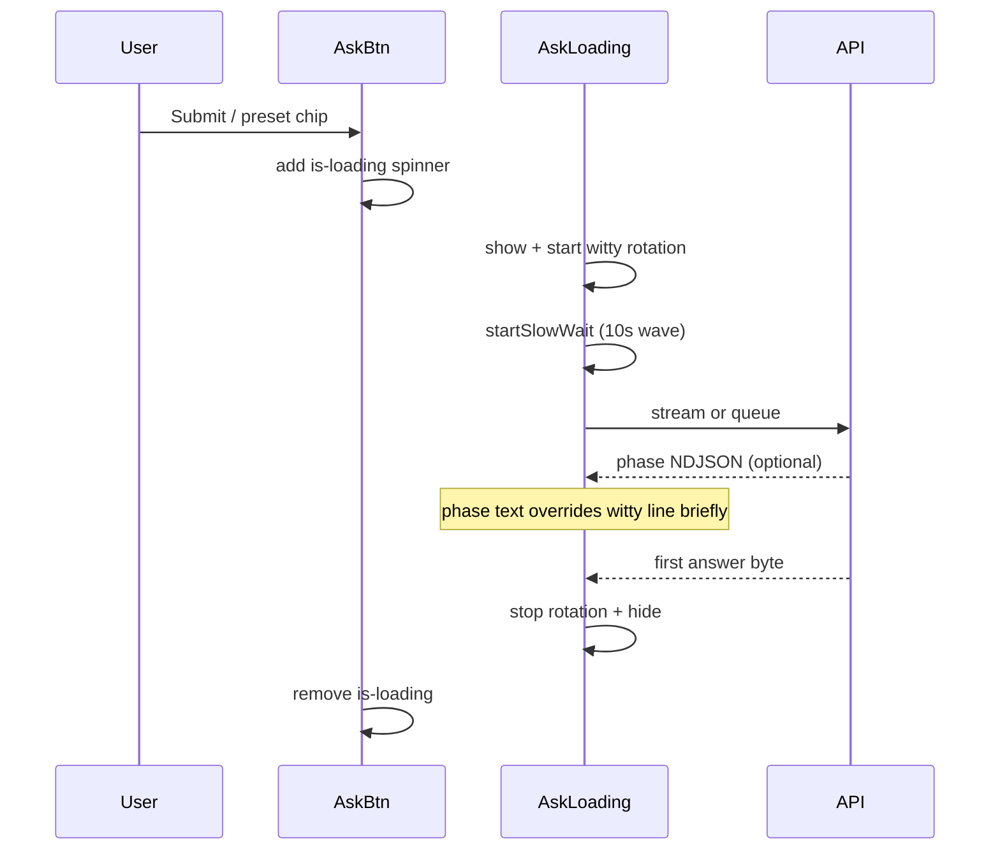

# Ask tab: button spinner + witty loading messages

## Problem

The Ask flow already has [`#ask-loading`](static/index.html) and phase text (`Figuring out how to answer…`, etc.), but feedback is easy to miss:

- The **Ask button** only disables — no in-button spinner.
- **Bouncing dots** appear only after **10s** via `startSlowWait` ([`SLOW_WAIT_MS = 10000`](static/index.html)).
- Status copy is functional, not playful — no rotating “hamster wheel” lines yet.

User chose **both**: immediate button spinner **and** rotating witty messages.

## Scope

**Single file:** [`static/index.html`](static/index.html) (CSS + JS only; no backend).

**In scope:** main Ask form (`#form-ask`) — preset chips, typed questions, mic + submit. **Out of scope:** General OpenAI forms (`#form-ask-general-open`, template form).

## Design



### 1. Ask button spinner (immediate)

**HTML** — give the submit button a stable hook:

```html
<button type="submit" id="btn-ask-submit">Ask</button>
```

**CSS** (near `.ask-actions-row` ~line 736):

- `@keyframes ask-btn-spin` — standard border spinner
- `#btn-ask-submit.is-loading` — `display: inline-flex; align-items: center; gap: 0.5rem`
- `#btn-ask-submit.is-loading::after` — 14px spinning ring using `currentColor`
- `@media (prefers-reduced-motion: reduce)` — static partial ring, no animation

**JS** — small helper used everywhere the Ask submit button is toggled:

```javascript
function setAskSubmitLoading(loading) {
  var btn = document.getElementById('btn-ask-submit');
  if (!btn) return;
  btn.disabled = !!loading;
  btn.classList.toggle('is-loading', !!loading);
  btn.setAttribute('aria-busy', loading ? 'true' : 'false');
}
```

Replace direct `submitBtn.disabled = true/false` in `submitAskStream`, `submitAskQueued`, and `pollAskJob` completion/error paths with `setAskSubmitLoading(true/false)` (pass `submitBtn` only if already threaded — or resolve button by id inside helper).

### 2. Rotating witty messages

**Message pool** (finance + hamster-wheel tone; easy to extend):

- "Dangling the carrot in front of the hamsters…"
- "The hamsters are warming up their wheels…"
- "Shuffling papers in the burrow…"
- "Consulting the wheel of compound interest…"
- "Herding tiny accountants…"
- "Still running — no hamsters were harmed…"

**JS helpers** (near `askPhaseLabel` ~line 3391):

```javascript
var ASK_WITTY_INTERVAL_MS = 4500;
var _askWittyTimer = null;
var _askWittyIndex = 0;
var _askPhaseUntil = 0; // timestamp: suppress witty while phase text is fresh

function startAskWittyRotation(el) { /* setInterval, pick next message */ }
function stopAskWittyRotation() { /* clearInterval */ }

function setAskLoadingText(el, text, opts) {
  setSlowWaitText(el, text);
  if (opts && opts.fromPhase) _askPhaseUntil = Date.now() + 3500;
}

function showAskLoading(el, initialText) {
  el.hidden = false;
  setAskLoadingText(el, initialText);
  startAskWittyRotation(el);
  startSlowWait(el); // keep existing 10s wave behavior
}

function hideAskLoading(el) {
  stopAskWittyRotation();
  stopSlowWait(el);
  el.hidden = true;
}
```

**Rotation rules:**

- On submit: `showAskLoading(askLoading, askPhaseLabel('routing'))` (stream) or queued initial text.
- Every **4.5s**: if `Date.now() < _askPhaseUntil`, skip tick (phase text stays visible).
- Otherwise: advance circular index through `ASK_WITTY_MESSAGES` and `setSlowWaitText`.
- Server phase updates call `setAskLoadingText(el, askPhaseLabel(phase), { fromPhase: true })` — same as today, but briefly pauses witty rotation.
- Queued poll updates (`data.stage`) also pass `{ fromPhase: true }`.

### 3. Wire into existing ask paths

| Location | Change |
|----------|--------|
| `submitAskStream` (~3513) | `setAskSubmitLoading(true)` on start; `showAskLoading` instead of manual unhide + `setAskLoadingText` + `startSlowWait`; `hideAskLoading` + `setAskSubmitLoading(false)` on all exit paths |
| `submitAskQueued` (~3463) | Same pattern |
| `pollAskJob` (~3439) | Phase updates use `{ fromPhase: true }` |
| `onStreamActivity` (~3564) | `setAskLoadingText(..., { fromPhase: true })` for `obj.phase` |
| `form-ask` submit handler (~3637) | No logic change — already delegates to stream/queue |

Preset chips already call `form-ask.requestSubmit()` — they pick up the new UX automatically.

### 4. Optional polish (low cost)

- Add `ask-loading-active` class on `#ask-loading` when visible and call `ensureSlowWaitWave` + `el.classList.add('slow-wait-active')` **immediately** for Ask only (so dots show at once, not after 10s). This is optional; button spinner + witty text may be enough. **Recommend including** — one extra line in `showAskLoading` using existing wave markup.

## Manual test checklist

1. **Preset chip** — click “How much in CDs?” → Ask button shows spinner immediately; witty line appears below form and rotates every ~4.5s.
2. **Stream mode** — phase text (“Searching your documents…”) appears when server sends it and holds ~3.5s before witty rotation resumes.
3. **Fast answer** — spinner and loading line disappear on first streamed token / job success; no stuck `aria-busy`.
4. **Queued mode** — spinner during enqueue + poll; stage labels still work.
5. **Error / timeout** — spinner cleared, witty timer stopped.
6. **Reduced motion** — button spinner static; wave dots static (existing rule).
7. **Narrow viewport** — action row layout from recent change still works; spinner does not break mic button row.

## Files unchanged

- No backend, tests, or help copy required unless you want the witty lines documented elsewhere later.
