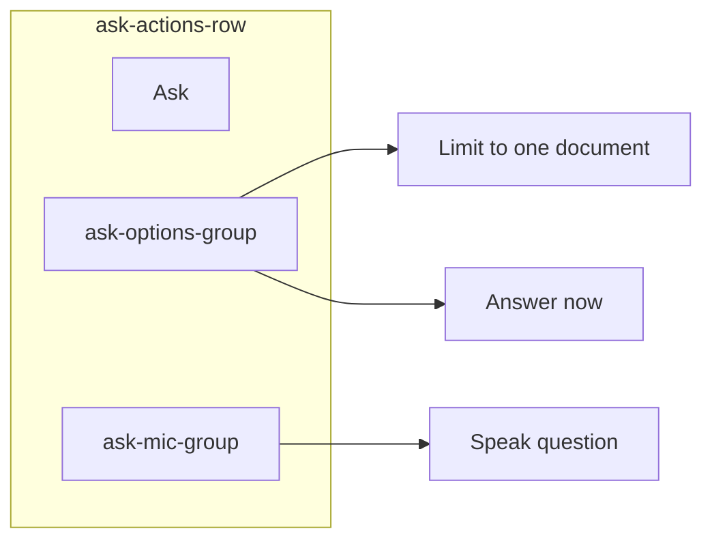

# Move Ask options between Ask and Speak

## Current layout

In [`static/index.html`](static/index.html), `#form-ask` is ordered:

1. Question textarea
2. `.ask-actions-row` — **Ask** (left) + **Speak question** (right on desktop)
3. `<details>` — Limit to one document (inside form, below the row)
4. `<details id="ask-stream-now-details">` — Answer now (outside `</form>`, below the row)

```1153:1172:static/index.html
          <div class="ask-actions-row">
            <button type="submit" id="btn-ask-submit">Ask</button>
            <div class="ask-mic-group">
              <span id="ask-mic-status" class="field-hint" hidden>Listening…</span>
              <button type="button" id="btn-ask-mic">Speak question</button>
            </div>
          </div>
          <details class="ingest-text-details">...</details>
        </form>
        <details id="ask-stream-now-details" class="ingest-text-details" hidden>...</details>
```

Mic and stream-mode JS bind by element ID (`#ask-doc_id`, `#ask-use-stream`, `#ask-stream-now-details`) — **no JS changes** if IDs are preserved.

## Target layout



- **Left:** Ask submit (unchanged)
- **Center:** both `<details>` summaries inline
- **Right:** Speak question + listening status (unchanged)

## Implementation (single file: [`static/index.html`](static/index.html))

### 1. HTML — restructure `.ask-actions-row`

Remove the two standalone `<details>` blocks from below the row. Insert a new middle group between Ask and the mic group:

```html
<div class="ask-actions-row">
  <button type="submit" id="btn-ask-submit">Ask</button>
  <div class="ask-options-group">
    <details class="ingest-text-details ask-action-details">
      <summary>Limit to one document (optional)</summary>
      <!-- label + #ask-doc_id select unchanged -->
    </details>
    <details id="ask-stream-now-details" class="ingest-text-details ask-action-details" hidden>
      <summary>Answer now (uses more CPU)</summary>
      <!-- hint + #ask-use-stream checkbox unchanged -->
    </details>
  </div>
  <div class="ask-mic-group">...</div>
</div>
```

Also move `#ask-stream-now-details` **inside** `#form-ask` (before `</form>`) so both optional controls live in one action row. The stream checkbox is read by JS, not submitted as a form field — safe to keep inside the form.

### 2. CSS — inline options in the action row

Add rules near the existing `.ask-actions-row` block (~line 796):

**Middle group (summaries inline):**
- `.ask-options-group` — `display: flex; flex-wrap: wrap; align-items: center; gap: 0.5rem 1rem; flex: 1; justify-content: center; min-width: 0`
- `.ask-options-group .ask-action-details` — override `.ingest-text-details { margin-top: 1rem }` with `margin: 0`
- `.ask-action-details summary` — keep muted link styling; optional `white-space: nowrap` so summaries stay on one line when space allows

**Expanded panels (avoid crushing the select/checkbox):**
- `.ask-options-group .ask-action-details[open]` — `flex-basis: 100%` so opened content drops below the two summaries within the middle column
- Tighten open spacing: `.ask-action-details[open] summary { margin-bottom: 0.5rem }` (slightly less than the global 1rem)

**Desktop row (≥600px):**
- Keep `.ask-actions-row { justify-content: space-between }` — three children naturally become left / center / right
- **Remove** `.ask-mic-group { margin-left: auto }` — no longer needed and would fight the three-column layout

**Narrow viewports (<600px):**
- Rely on existing `flex-wrap: wrap` on `.ask-actions-row`
- DOM order preserves Ask → options → Speak when items wrap (options stay between the buttons vertically)

### 3. No other changes

- `applyAskModeUi()` toggles `#ask-stream-now-details` via `hidden` — unchanged
- `loadAskDocuments()` populates `#ask-doc_id` — unchanged
- Easy UI 48px mic button rule — unchanged
- No backend or help copy updates required

## Manual verification

1. **Desktop (≥600px):** Ask left, both option summaries centered, Speak right on one row
2. **Queued mode:** background note appears; "Answer now" summary visible in the middle; checkbox still toggles immediate streaming
4. **Non-queued mode:** stream details stays hidden; doc filter still works
5. **Open each `<details>`:** select / checkbox usable; expanded panel does not overlap Ask or Speak
6. **Narrow (~375px):** row wraps cleanly; preset chip submit and mic still work
7. **Easy UI:** tap targets on Ask and Speak unchanged
