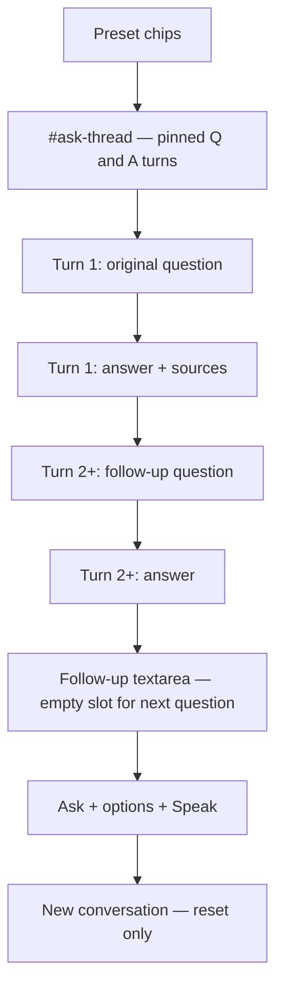

# Persistent Ask thread and unified Ask button

## Problem

When a follow-up is submitted, the UI **clears the conversation surface** even though the request is still running:

```4493:4497:static/index.html
        msg.hidden = true;
        answerBlock.hidden = true;
        hideAskFollowupBlock();
        showAskLoading(askLoading, askPhaseLabel('routing'));
        setAskSubmitLoading(true);
```

The same pattern exists in [`submitAskQueued()`](static/index.html) (`answerBlock.hidden = true` + `hideAskFollowupBlock()`). After a successful answer, [`resetAskQuestionInput()`](static/index.html) clears the original question textarea, so the first question disappears too.

Result: user sees only the global spinner (`#ask-loading`) and loading state on **Ask** (stream path) while prior Q&A vanish — even though processing is working.

## Target layout

Reorder the main Ask panel to match your mental model:



**Behavior rules**

- **First ask:** use `#ask-question`; on submit, pin that text into the thread (do **not** clear the textarea via `resetAskQuestionInput()`).
- **Follow-ups:** use `#ask-followup-question`; on submit, append a new turn to the thread and clear only the follow-up field.
- **Single Ask button** (`#btn-ask-submit`) handles both: if `activeConversationId` is set, read follow-up textarea; otherwise read main question.
- **During processing:** never hide `#ask-thread` or prior turns; show loading on the **pending turn** (small inline spinner / phase text) and keep the main `#ask-loading` as a secondary status line if needed.
- **Reset:** only **New conversation** clears thread, answers, conversation id, and both textareas.

## Implementation (single file: [`static/index.html`](static/index.html))

### 1. HTML restructure (~lines 1256–1297)

- Add `#ask-thread` container **above** the composer, initially hidden.
- Move `#ask-answer` content model into per-turn elements created in JS (keep existing ids as **first-turn targets** during migration, or replace with thread helpers — see below).
- Move `#ask-followup-block` **above** `.ask-actions-row` (inside `#form-ask`, before Ask button):
  - Keep `#ask-followup-question` textarea.
  - Remove `#btn-ask-followup` (Ask submit replaces it).
  - Keep `#btn-ask-new-conversation` in follow-up actions; show when `activeConversationId` is set.
- Leave preset chips, doc scope, mic, and history section unchanged.

### 2. Thread helpers (new JS near `activeConversationId`)

Add small DOM helpers (no new files):

| Function | Purpose |
|----------|---------|
| `createAskTurn(questionText)` | Returns `{ el, questionEl, answerMd, answerExtra, sourcesEl, loadingEl }` |
| `appendAskTurn(questionText)` | Appends to `#ask-thread`, shows thread container |
| `getActiveAskTurn()` | Returns the turn currently being answered (for stream/queue targets) |
| `setTurnLoading(turn, on, text?)` | Inline loading on pending turn only |
| `renderTurnAnswer(turn, md, struct, relatedDocs)` | Uses existing `renderAnswerBlocks` + `renderAskSources` pattern |

**First turn:** on initial submit, if thread is empty, create turn from `#ask-question` value and optionally make `#ask-question` read-only (`readonly` + muted styling) so the original question stays visible at the top.

**Follow-up turns:** append turn with follow-up text; clear `#ask-followup-question` immediately after pinning (question stays in thread).

### 3. Fix submit paths (core bug fix)

In **`submitAskStream()`** and **`submitAskQueued()`**:

| Remove | Replace with |
|--------|----------------|
| `answerBlock.hidden = true` | Keep thread visible; `setTurnLoading(activeTurn, true)` |
| `hideAskFollowupBlock()` at start | Keep follow-up textarea visible; disable Ask + textarea while loading |
| `resetAskQuestionInput()` on success | Only clear follow-up field; never clear pinned first question |
| Writing only to `#ask-answer-md` | Stream/render into `getActiveAskTurn().answerMd` |

On stream start, show the answer block area for the **pending turn** immediately (empty answer + inline “Working…”), matching current stream preview behavior but scoped to that turn.

On error, leave prior turns intact; show error on the pending turn or `#ask-message`.

### 4. Unify form submit handler

Replace the separate `#btn-ask-followup` click handler with logic in `#form-ask` submit:

```javascript
var questionText, isFollowup;
if (activeConversationId) {
  questionText = followupTa.value.trim();
  isFollowup = true;
  // validation: "Type a follow-up question first."
} else {
  questionText = askQuestionTa.value.trim();
  isFollowup = false;
  // validation: preset / type message
}
var body = buildAskBody(questionText, isFollowup);
```

Remove `#btn-ask-followup` listener entirely.

Update **`setAskSubmitLoading()`** so the one Ask button shows spinner for both first and follow-up requests (already wired for stream; queued path uses same button).

### 5. Follow-up visibility without hiding

- **`showAskFollowupBlock()` / `hideAskFollowupBlock()`:** show follow-up textarea + New conversation when `activeConversationId` is set; do **not** hide on submit.
- **`resetActiveConversation()`:** clear `#ask-thread`, restore editable `#ask-question`, hide thread, hide follow-up block, clear ids.

### 6. Resume from history

Update [`resumeAskConversation()`](static/index.html) to rebuild `#ask-thread` from `groupTurns` (same structure as history nested turns) instead of dumping only the latest answer into `#ask-answer-md`.

### 7. Preset chips and mic (sensible defaults)

Since preset = new topic:

- **Preset chip during active conversation:** call `resetActiveConversation()` first, then fill `#ask-question` and submit (auto new conversation).
- **Mic:** when `activeConversationId` is set, transcribe into `#ask-followup-question`; otherwise `#ask-question`.

### 8. CSS additions (~`.ask-followup-block`)

- `.ask-thread`, `.ask-turn`, `.ask-turn-question` (muted label or blockquote style)
- `.ask-turn-answer` spacing consistent with `.ask-general-answer-wrap`
- `.ask-turn-loading` inline spinner under pending question
- Read-only `#ask-question[readonly]` styling
- Adjust `.ask-followup-block` top border now that it sits above the action row (not inside answer card)

## Files touched

- [`static/index.html`](static/index.html) only — HTML, CSS, and inline JS (matches existing Ask UI patterns; no backend changes).

## Manual verification

1. **First question (stream):** ask → question stays visible, answer appears below, follow-up field appears above Ask, New conversation visible.
2. **Follow-up (stream):** type follow-up → Ask → prior Q+A remain; new question pinned; inline loading on new turn; answer streams into new turn only.
3. **Queued mode:** same persistence through `submitAskQueued` / `pollAskJob`.
4. **New conversation:** clears thread, restores empty editable question, hides follow-up.
5. **History resume:** Continue this conversation rebuilds full thread.
6. **Preset during conversation:** starts fresh thread with preset question.
7. **Error path:** failed ask does not wipe prior turns.

## Out of scope

- Backend / API changes (conversation_id flow already works).
- General advice (OpenAI) section — separate forms, unchanged.
