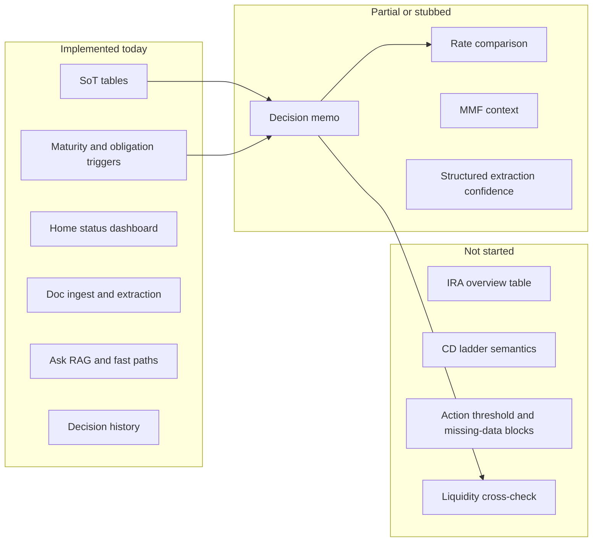

# How Close Is Finelly to the CD Ladder Vision?

**Short answer:** You are roughly **55–65% of the way to ChatGPT's Version 1** — closer on *architecture and philosophy* (~80%) than on *decision-quality features* (~40%). Finelly already renamed and reframed itself as a narrow cash assistant ([FINANCIAL-ASSISTANT.md](FINANCIAL-ASSISTANT.md)), which matches the ChatGPT recommendation almost exactly. What remains is mostly **making decisions at maturity windows actually useful**, not rebuilding the foundation.

---

## Vision vs. reality at a glance



---

## Scorecard against ChatGPT's Version 1 must-haves

| Must-have (ChatGPT) | Finelly status | Est. complete |
|---|---|---|
| **One current ladder table** | `positions` + `accounts` act as a flat holdings table; no ladder grouping, no `start_date` / `liquidity` / `next_action` columns | **~55%** |
| **Trigger-date alerts** | [`app/triggers.py`](app/triggers.py) fires on maturity (30-day window) and obligation due dates; Home shows overdue/upcoming | **~70%** |
| **Decision memo at maturity** | [`GET /decision`](app/main.py) returns status + memo + optional OpenAI bullets; not hold/roll/MMF/wait format | **~40%** |
| **Cash obligation cross-check** | Obligations tracked separately; no logic linking "June maturity principal vs known June bill" | **~20%** |
| **Current safe-yield comparison** | [`fetch_cd_rates()`](app/reference_data.py) returns `[]`; `rate_snapshots` table unused | **~10%** |
| **Clear source citations** | Decision response includes `UserDataSource` + intended `WebSource`; hierarchy documented but not enforced in prompts | **~65%** |

**Nice-to-haves from ChatGPT:**

| Feature | Status |
|---|---|
| 1099 / tax-doc extraction | Tax tags (`1099`, `w2`) on ingest; no dedicated explanation flow |
| Brokered vs CU CD comparison | Not implemented |
| MMF "worth it?" comparison | Generic `Money market` asset type; VMFXX only in docs ([instructions.md](instructions.md)) |
| Simple decision log | **Done** — `decision_history` + Manage → Past advice |

---

## What already matches the ChatGPT vision well

### 1. Scope is already narrowed (ChatGPT §1A, §3)

Finelly is **not** a broad portfolio agent. It focuses on CDs, money market, treasuries, obligations, and document Q&A. No stock screening, no active trading, no macro commentary engine. This aligns with the recommended rename to a **cash-management assistant** — the product is already branded **Ledgerly** with that framing in [overview.md](overview.md) and [FINANCIAL-ASSISTANT.md](FINANCIAL-ASSISTANT.md).

### 2. SoT-centered design (ChatGPT §1B)

The three-table model maps cleanly:

| ChatGPT table | Finelly equivalent | Gap |
|---|---|---|
| Taxable CD Ladder | `accounts` + `positions` | Missing ladder view; columns like start date, liquidity, trigger date, next action |
| IRA Overview | — | **Not started** (no IRA account type, no RMD/tax-advantaged fields) |
| Known Cash Obligations | `obligations` | Works; no recurrence, no payment partials |

Schema today ([`app/db.py`](app/db.py) lines 103–115):

- `positions`: `asset_type`, `description`, `principal`, `rate_apr`, `maturity_date`, `document_id`, `resolved_at`
- Principle "database is SoT; documents verify" is documented and implemented via confirm-extraction and auto-track flows

### 3. Trigger engine exists (ChatGPT §1C)

[`evaluate_triggers()`](app/triggers.py) implements the core discipline: **only act when something is in-window**. Default horizons: `MATURITY_DAYS_AHEAD=30`, `OBLIGATION_DAYS_AHEAD=30` ([`app/config.py`](app/config.py)).

When no triggers: `"No action required"` — exactly what ChatGPT asked for.

**Missing trigger types:** material rate change, tax/RMD change, configurable 45-day early warning tier.

### 4. Three output modes — partially (ChatGPT §1D)

| Mode | Finelly |
|---|---|
| **Status check** | **Strong** — Home via [`GET /dashboard`](app/dashboard.py): next maturity, upcoming/overdue, totals by asset type, renewal tips |
| **Decision memo** | **Weak** — short text memo + generic OpenAI options; not the operational Item/Answer/Trigger/Options/Recommendation/Next dates format |
| **Document extraction** | **Strong** — PDF/image ingest, structured extraction ([`app/ingest_structured.py`](app/ingest_structured.py)), confirm/auto-track, vault |

### 5. Practical workflow (ChatGPT §2) — mostly usable today

The recommended rhythm (monthly status, 45–30 days before maturity, upload docs as needed, decision-framed Ask questions) **can be done manually**:

1. Maintain tables → Manage → Data (accounts/positions/obligations)
2. Upload docs → Add document tab; auto-track or confirm on Home
3. Status → Home auto-loads dashboard; actionable items pull `/decision` advice
4. Ask → preset chips match ChatGPT examples ("What's maturing…", "How much in CDs", bills due, accounts summary) via [`app/ask_fast_paths.py`](app/ask_fast_paths.py)

**Gap:** Ask does not yet answer "Do I need this rung liquid for known obligations?" or "Compare rolling to 6-month CD vs VMFXX" with structured, sourced comparisons.

### 6. Privacy model (ChatGPT source hierarchy intent)

Documented in FINANCIAL-ASSISTANT.md: local Ollama for RAG; OpenAI only for sanitized generic advice (principal/rate, no PII) in `/decision`. This matches the privacy split ChatGPT implied.

---

## Biggest gaps blocking "decision window assistant" quality

These are ordered by **value per effort** for your use case:

### Gap 1 — Rate comparison is stubbed (highest value)

- [`fetch_cd_rates()`](app/reference_data.py) returns an empty list
- `rate_snapshots` table exists but is never populated
- Finance MCP sidecar exists but is disabled in Ask ([`app/finance_tools_client.py`](app/finance_tools_client.py))
- Decision memos cannot say "your 4.5% vs ~5.1% for 12-mo CD" or "MMF worth it?"

**Impact:** ChatGPT's core value prop at maturity windows — *compare safe options* — is not deliverable yet.

### Gap 2 — Decision memos are generic, not operational

Current `/decision` OpenAI prompt ([`app/main.py`](app/main.py) ~2234–2238):

```python
"What should someone do if they have {principal_str} in a CD maturing now? ..."
"Give exactly 2-3 short options..."
```

Missing from ChatGPT's target format:

- Trigger / relevant holdings / options (hold, roll, MMF, wait) / comparison axes (safety, income, liquidity, simplicity, tax) / recommendation / next dates
- **Action threshold rule** (don't recommend switching unless net yield, liquidity, simplicity, or obligation requires it)
- **Confidence + missing data** footer (known / assumed / missing / provisional vs final)

Extraction has `confidence` on staging JSON; decision output does not.

### Gap 3 — No IRA awareness table

Zero references to IRA, RMD, or tax-advantaged account types in code. ChatGPT listed this as "awareness only" — low complexity, but not started.

### Gap 4 — No CD ladder semantics

"Ladder" appears only in naming conventions ([instructions.md](instructions.md), sample docs). No:

- Rung grouping or timeline view
- Term length field (inferred from description + maturity only)
- Ladder-level liquidity projection ("cash available in N days across rungs")

You *can* manually enter staggered CD positions and see them on Home — functional but not ladder-native.

### Gap 5 — No liquidity cross-check

Obligations and maturities are surfaced independently. Nothing answers: "Will the June 17 maturity cover the June 20 property tax?" or "Keep this rung liquid."

### Gap 6 — Doc/UI drift

[docs/decision-status-test-guide.md](docs/decision-status-test-guide.md) still describes a separate Status tab; UI merged status into Home ([static/index.html](static/index.html)). Minor, but affects onboarding clarity.

---

## Feature-area completion estimate

| Area | % complete | Notes |
|---|---|---|
| **Philosophy and scope** | **~80%** | Already a narrow cash assistant, not a general financial agent |
| **SoT tables (3-table model)** | **~60%** | 2 of 3 tables; positions missing ladder-specific columns |
| **Trigger engine** | **~65%** | Maturity + obligation only; no rate/tax triggers |
| **Status check mode** | **~85%** | Home dashboard is the strongest feature |
| **Decision memo mode** | **~35%** | Exists but not operational-grade |
| **Document extraction mode** | **~80%** | Ingest, OCR, structured extract, vault, auto-track |
| **Rate / MMF comparison** | **~10%** | Infrastructure stubs only |
| **Guardrails (source hierarchy, action threshold, confidence)** | **~25%** | Documented partially; not enforced in memo generation |
| **IRA awareness** | **~0%** | Not started |
| **Overall Version 1 (weighted)** | **~55–65%** | Foundation solid; decision quality is the bottleneck |

---

## What you can use it for today vs. what you cannot

### Works well today (matches ChatGPT's intended rhythm)

- Maintain holdings and obligations as SoT
- Upload CD confirmations, statements, rate sheets, 1099s; search/extract via Ask
- Monthly quick status: Home shows next maturity, overdue items, totals
- 30-day trigger window: actionable status + renewal tips + Past advice log
- Preset Ask questions for maturities, CD totals, bills, account summary
- Privacy-preserving local RAG over your documents

### Not yet reliable for your daughter's vision

- "Compare rolling to 6-month CD vs holding in VMFXX" with sourced numbers
- Structured hold/roll/MMF/wait recommendation memo at a specific maturity
- "Do I need this rung liquid for known obligations?"
- IRA/RMD awareness reminders
- "Is the extra yield worth the added complexity?" with action-threshold discipline
- Proactive rate-change triggers

---

## Recommended path to close the remaining ~35–45%

If you want to reach ChatGPT's "80–90% of value" Version 1, prioritize in this order:

### Phase A — Make maturity decisions actually useful (~2–3 focused efforts)

1. **Wire rate comparison into `/decision`**
   - Implement `fetch_cd_rates()` (even a curated manual snapshot or one public source)
   - Compare `position.rate_apr` vs fetched rates in memo text
   - Optionally re-enable finance-tools for VMFXX yield quote

2. **Restructure decision memo output**
   - Replace generic OpenAI prompt with ChatGPT's operational template (Trigger → Options → Comparison → Recommendation → Next dates)
   - Add `known / assumed / missing / provisional` footer
   - Encode action-threshold rule in prompt or deterministic pre-check

3. **Liquidity cross-check**
   - When maturity trigger fires, list obligations due within ±N days and flag coverage gaps

### Phase B — Ladder and IRA awareness (~1–2 efforts)

4. **Ladder presentation layer** (minimal schema change)
   - Group positions by account or optional `ladder_id`
   - Home timeline/table view with Institution, Type, Principal, APY, Maturity, Days until
   - Optional columns: `start_date`, `next_action` (user-editable)

5. **IRA overview table**
   - New `account.type = 'ira'` or separate lightweight table: institution, balance estimate, RMD note, next relevant date
   - Awareness-only triggers (no investment advice)

### Phase C — Polish (~1 effort)

6. **Align docs and prompts**
   - Rewrite [FINANCIAL-ASSISTANT.md](FINANCIAL-ASSISTANT.md) / help as the "core operating instructions" (ChatGPT Q3)
   - Update decision-status test guide for Home-centric UX
   - Add Ask preset or fast path: "What is my next decision trigger?"

---

## Mapping to ChatGPT's three follow-up questions

| Question | Status |
|---|---|
| **Q1 — Rewrite proposal for your use case** | **~70% done implicitly** — FINANCIAL-ASSISTANT.md and overview already reflect the narrowed vision; a formal rewrite would mostly document gaps above |
| **Q2 — Version 1 feature list (do / don't)** | **~75% done in code + docs** — scope is right; explicit do/don't checklist in docs would complete it |
| **Q3 — Core operating prompt/instructions** | **~40% done** — principles exist; decision memo prompt and Ask system prompt don't yet encode action threshold, source hierarchy, or operational output format |

---

## Bottom line

Finelly is **not** starting from zero — it is a credible **maturity and obligation tracker with document RAG** that already embodies ChatGPT's most important architectural choices (narrow scope, SoT-first, trigger-only recommendations, privacy split).

It is **not yet** the full **"decision window assistant"** your daughter described because the features that matter most at maturity — **rate comparison, structured memos, liquidity cross-check, and churn-prevention guardrails** — are stubbed or generic.

**Practical estimate:** You have the **container and workflow** (~80%); you have about **half the decision intelligence** (~40%). Combined: **~55–65% of Version 1**, with the next 20–25% coming almost entirely from Phase A above.
