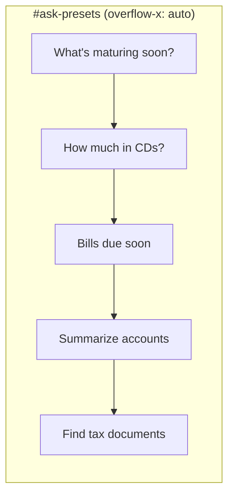

# Horizontal scroll for Ask preset chips

## Current behavior

The Ask panel renders five preset buttons inside `#ask-presets`:

```1131:1137:static/index.html
        <div class="ask-presets" id="ask-presets">
          <button type="button" class="ask-preset-chip" data-question="What's maturing in the next 3 months?">What's maturing soon?</button>
          <button type="button" class="ask-preset-chip" data-question="How much do I have in CDs?">How much in CDs?</button>
          ...
        </div>
```

They are styled as a wrapping flex row:

```775:783:static/index.html
    .ask-presets { display: flex; flex-wrap: wrap; gap: 0.5rem; margin: 0.75rem 0 1rem; }
    .ask-preset-chip {
      background: var(--surface);
      border: 1px solid var(--border);
      border-radius: 999px;
      cursor: pointer;
      color: var(--text);
    }
```

On smaller screens (and in Easy UI mode with larger tap targets), chips wrap to multiple lines instead of staying in one scrollable row.

## Proposed change

**CSS-only** update in [`static/index.html`](static/index.html) — no JS or markup changes needed (click handlers already work on `.ask-preset-chip`).

### 1. Update `.ask-presets` container

Replace `flex-wrap: wrap` with a horizontal scroll row:

- `flex-wrap: nowrap`
- `overflow-x: auto`
- `-webkit-overflow-scrolling: touch` (smooth momentum scroll on iOS)
- `scrollbar-width: thin` (subtle scrollbar on Firefox)
- Optional: small vertical padding (`padding-bottom: 0.25rem`) so a thin scrollbar does not clip chip borders

### 2. Update `.ask-preset-chip` items

Prevent chips from shrinking or breaking mid-label:

- `flex-shrink: 0`
- `white-space: nowrap`
- Add base padding (`padding: 0.5rem 1rem`) so chips look consistent outside Easy UI mode (Easy UI already overrides min-height/padding at line 651)

### 3. Minor accessibility touch (optional but low-cost)

Add to the existing `#ask-presets` div:

- `role="group"`
- `aria-label="Preset questions"`

This helps screen readers identify the scrollable chip group without changing behavior.

## Expected result



- **Wide viewport:** all chips visible in one line (same as today when they fit).
- **Narrow viewport:** chips stay on one line; user scrolls/swipes horizontally to reach the rest.
- **Easy UI mode:** unchanged tap-target sizing; horizontal scroll still applies.

## Verification

Manual check in browser (Ask tab):

1. Resize to mobile width (~375px) — chips should stay on one row and scroll horizontally.
2. Confirm each chip still fills the question textarea and submits on click.
3. Confirm Easy UI mode (`body.easy-ui`) still shows 48px-tall chips.
4. Keyboard: tab to a chip, click still works; scroll area scrolls with trackpad/shift+scroll where supported.

No test file changes required — this is presentational only.
