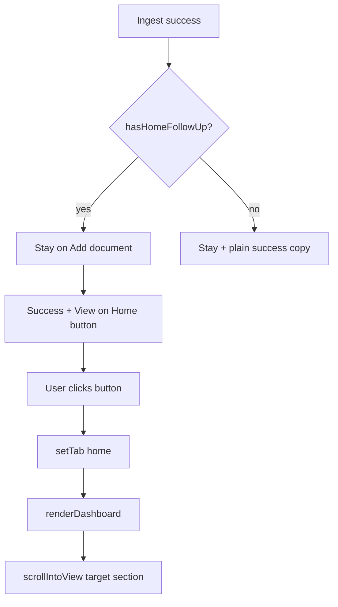

# Ingest success: stay on Add document, optional Home link

## Problem

Today, when ingest finds a CD maturity or bill due date, [`handleIngestSuccess`](static/index.html) and batch completion in [`handleJobQueueComplete`](static/index.html) call `setTab('home')` and may open the track modal — a jarring tab switch right after upload.

```2860:2877:static/index.html
if (shouldGoHomeAfterIngest(data)) {
  // ...
  setIngestSuccessMessage(successMsg, actionItems);
  setTab('home');
  if (!trackedLine) {
    if (data.extracted_position && data.extracted_position.maturity_date) {
      showTrackModal(data.doc_id, data.extracted_position, 'position');
    } else if (data.extracted_obligation && data.extracted_obligation.due_date) {
      showTrackModal(data.doc_id, data.extracted_obligation, 'obligation');
    }
  }
}
```

The success text is written to `#ingest-message`, but switching tabs hides the ingest panel — so the user lands on Home without a clear “you just finished uploading” moment.

## Target behavior

| Ingest outcome | Stay on Add document? | Home button scroll target |
|---|---|---|
| Auto-tracked CD/bill | Yes | `#home-recently-added` |
| Extracted maturity (needs confirm) | Yes | Pending CD card for that `doc_id` |
| Extracted bill due date (needs confirm) | Yes | Pending bill card for that `doc_id` |
| Plain document (no dates) | Yes (already) | No button |

User clicks the button when ready; Home opens and scrolls to the relevant block.



## Implementation (frontend only — [`static/index.html`](static/index.html))

### 1. Rename / extend the helper

Rename `shouldGoHomeAfterIngest` → `hasHomeFollowUp` (same logic, clearer intent).

Add `getHomeFollowUpTarget(data)` returning e.g. `{ sectionId, docId?, kind? }`:

- `auto_tracked_position` or `auto_tracked_obligation` → `{ sectionId: 'home-recently-added' }`
- `extracted_position.maturity_date` → `{ sectionId: 'home-pending-extractions', docId, kind: 'position' }`
- `extracted_obligation.due_date` → `{ sectionId: 'home-pending-obligation-extractions', docId, kind: 'obligation' }`

For batch uploads, pick the **most actionable** target across results (pending confirm beats recently-added; first match wins).

### 2. Add stable scroll anchors on Home

In [`renderPendingExtractions`](static/index.html) and [`renderPendingObligationExtractions`](static/index.html), set card IDs:

- `id="home-pending-position-{document_id}"`
- `id="home-pending-obligation-{document_id}"`

`#home-recently-added` already exists and is sufficient for auto-tracked items.

### 3. Navigation + scroll helper

Add `goToHomeFollowUp(target)`:

1. Set `sessionStorage` key (e.g. `ledgerly-home-scroll-target`) with the target JSON
2. Set `ledgerly-track-prompted` so we do **not** also pop the legacy track modal
3. Call `setTab('home')`

Add `applyHomeScrollTarget()` called at the **end** of `renderDashboard`:

- Read and clear the sessionStorage target
- Resolve element: doc-specific pending card if `docId` set, else `sectionId`
- `scrollIntoView({ behavior: 'smooth', block: 'start' })` (same pattern as existing Ask scroll at ~L3517)

### 4. Extend success message UI

Update `setIngestSuccessMessage(text, actionItems, homeFollowUp)` to optionally append a button row below Preview/Open actions:

- **Pending confirm:** `"Go to Home to confirm tracking →"`
- **Auto-tracked:** `"View on Home →"`
- Click handler calls `goToHomeFollowUp(homeFollowUp)`

Reuse existing `.ingest-success-actions` / `.home-row-btn` styles (no new CSS required unless spacing needs a tweak).

### 5. Update ingest success handlers

**`handleIngestSuccess`:**

- Keep `loadDashboard()` (Home data stays fresh in background)
- Remove `setTab('home')`
- Remove inline `showTrackModal(...)` calls after ingest
- When `hasHomeFollowUp(data)`: build success copy that mentions what was found (tracked line or “confirm on Home”), pass `getHomeFollowUpTarget(data)` into `setIngestSuccessMessage`

**`handleJobQueueComplete`:**

- Remove `if (goHome) setTab('home')`
- If any batch result has follow-up, compute batch target + add the same Home button to the batch success message

### 6. Guard `maybePromptPendingExtraction`

[`maybePromptPendingExtraction`](static/index.html) currently runs inside `renderDashboard` and can open the track modal even while the user is still on Add document (because `loadDashboard()` runs after ingest regardless of tab).

Add a guard: only auto-prompt when the Home panel is active **and** no ingest-initiated scroll target is pending. This prevents a modal popping over the ingest tab after the UX change.

### 7. Success copy (concise examples)

- Auto-tracked CD: `"Success! … Tracked: CD · matures 2026-03-15."` + button
- Pending CD: `"Success! … Found a maturity date — confirm tracking on Home."` + button
- Pending bill: `"Success! … Found a due date — confirm on Home."` + button

## Files touched

| File | Change |
|---|---|
| [`static/index.html`](static/index.html) | All logic above (~60–80 lines net) |
| Backend | None — [`IngestResponse`](app/models.py) already exposes `auto_tracked_*`, `extracted_*` |

## Manual verification

1. **CD letter (auto-track):** ingest → stay on Add document → success + “View on Home” → click → Home scrolls to Recently added
2. **CD letter (auto-track off / pending):** success + “Go to Home to confirm tracking” → click → scrolls to pending CD card with Yes/Not now (no track modal on ingest tab)
3. **Bill reminder:** same for obligation pending card
4. **Generic PDF:** stay on Add document, no Home button (unchanged)
5. **Multi-file batch** with one CD + one generic PDF: one Home button, scrolls to pending/recently-added target
6. **Preview/Open buttons** still appear on success (existing behavior)

## Out of scope

- Removing the track modal entirely (still usable from Home if needed elsewhere)
- Changing Home card layout or backend dashboard API
- Automated frontend tests (none exist for this SPA today)
