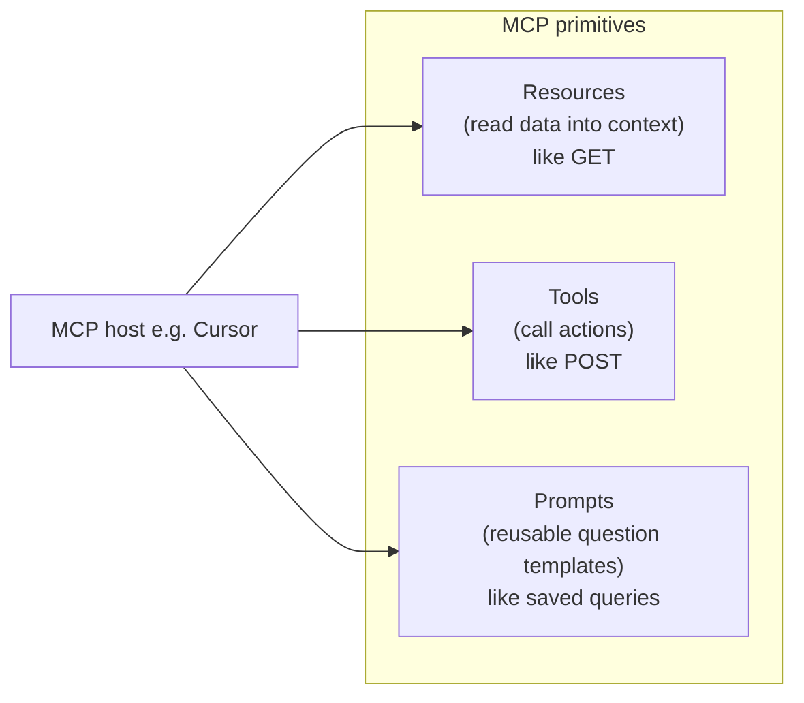
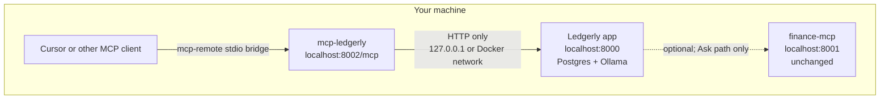

# Ledgerly MCP: resources, prompts, and local privacy

## What we are building (in plain terms)

Ledgerly today has two different “agent” surfaces:

| Surface | What it is | What it exposes |
|---------|------------|-----------------|
| **[mcp-finance-tools](mcp-finance-tools/)** | Small sidecar MCP server | **Tools only**: compound interest + optional Finnhub stock quotes |
| **Ledgerly web app Ask** | Internal RAG + local tools in [app/ask_tools.py](app/ask_tools.py) | CD triggers, liquidity checks, document search — but **not MCP** |

We will add a **third piece**: **`mcp-ledgerly`**, a dedicated MCP server aligned with [FINANCIAL-ASSISTANT.md](FINANCIAL-ASSISTANT.md) (CD ladder, obligations, triggers — not ticker analysis).

MCP has three main primitives. Think of them like a REST API:



- **Resources** — passive data the agent can browse (e.g. “what documents exist?”)
- **Tools** — things the agent explicitly calls (e.g. “run liquidity cross-check”)
- **Prompts** — pre-built question templates with `{arguments}` (e.g. “review my maturity decision for position X”)

**Why a new server?** The existing [mcp-finance-tools/main.py](mcp-finance-tools/main.py) uses `fastapi-mcp`, which auto-generates **tools from FastAPI routes only**. It does **not** support MCP resources or prompts. For those, we use the official **`mcp` Python SDK** (`FastMCP`) in a new package.

**Why not bolt this onto finance-mcp?** That server’s purpose is generic calc/quotes (and Finnhub). Ledgerly’s product is local SoT tables + ingested documents. Keeping them separate makes the privacy story and learning path clearer.

---

## Architecture



**Data flow rule:** `mcp-ledgerly` never talks to Finnhub, OpenAI, or the public internet for Ledgerly data. It only calls Ledgerly’s existing REST API (e.g. [`GET /documents`](app/main.py), [`GET /decision`](app/main.py), [`GET /dashboard`](app/main.py)).

**Important privacy caveat (same as our earlier discussion):** Keeping the MCP **server** local does not automatically keep data off cloud LLMs. When Cursor reads a resource, that text enters Cursor’s agent context. For maximum privacy: use metadata-only resources (below) and a local LLM in the MCP host. Document this in the new server’s README.

---

## Phase 1 — Core MCP learning deliverable

Goal: you can connect Cursor, see `ledgerly://` resources, run on-brand prompts, and call a few basic tools — all without changing Ledgerly’s core Ask pipeline.

### 1. New package: `mcp-ledgerly/`

Create a sibling to [mcp-finance-tools/](mcp-finance-tools/):

```
mcp-ledgerly/
  main.py              # FastMCP server + HTTP transport on /mcp
  ledgerly_client.py   # httpx client → LEDGERLY_BASE_URL
  resources.py         # ledgerly:// URI handlers
  prompts.py           # @mcp.prompt templates
  tools.py             # thin REST proxies (Phase 1 subset)
  requirements.txt     # mcp, httpx, uvicorn
  Dockerfile
  README.md            # what/why, Cursor config, privacy tiers
  CONNECTING.md        # mirror finance-mcp style
  TESTING.md           # manual verification steps
```

**Config (env):**

| Variable | Default | Purpose |
|----------|---------|---------|
| `LEDGERLY_BASE_URL` | `http://localhost:8000` | Ledgerly app base URL |
| `PORT` | `8002` | MCP HTTP port (avoid clash with app 8000, finance 8001) |
| `LEDGERLY_MCP_PRIVACY` | `metadata` | `metadata` strips snippets/paths; `full` passes through API fields |

Docker Compose: set `LEDGERLY_BASE_URL=http://ledgerly:8000` inside the container network.

### 2. MCP resources (document index)

Expose read-only JSON resources backed by existing Ledgerly endpoints:

| URI | Source | Default payload (privacy=metadata) |
|-----|--------|-------------------------------------|
| `ledgerly://documents` | `GET /documents` | `doc_id`, `title`, `tags`, `num_chunks`, `created_at` — **omit** `snippet`, `facts_learned`, `original_vault_path`, `linked_account_ids` |
| `ledgerly://documents/{doc_id}` | filter from list | Same stripped fields for one doc |
| `ledgerly://dashboard{?days}` | `GET /dashboard` | Summary counts / upcoming dates (no raw doc text) |
| `ledgerly://decision` | `GET /decision` | Trigger memo JSON already structured for operational use |

**Why metadata-only by default:** Titles may still be sensitive (“PenFed CD maturity notice”), but we avoid pushing document body text or vault paths into the agent context unless the user opts into `LEDGERLY_MCP_PRIVACY=full`.

Implementation note: Ledgerly has no `GET /documents/{doc_id}` today; the MCP server can filter the list response (fine for typical personal doc counts). Optional small follow-up: add `GET /documents/{doc_id}` to the main app for efficiency.

### 3. MCP prompts (on-brand, not ticker)

Register 5 prompts that encode Ledgerly’s operating rules (source hierarchy, action threshold, no stock advice). Each prompt expands to instructions + suggested tool/resource usage:

| Prompt name | Args | Maps to existing product |
|-------------|------|--------------------------|
| `review-decision-triggers` | optional `days_ahead` | Ask preset “Next decision trigger”; [`GET /decision`](app/main.py) |
| `liquidity-cross-check` | optional `position_id` | setup_and_testing F3; needs Phase 2 tool or prompt instructs manual review of dashboard/decision |
| `maturity-roll-options` | optional `position_id` | F4/F5; references decision memo + positions |
| `list-ingested-documents` | none | F9; reads `ledgerly://documents` |
| `document-scoped-question` | `doc_id`, `question` | UI “Limit to document”; tells agent to treat one doc as primary |

Prompt text should echo rules from [app/ask_graph.py](app/ask_graph.py) `_build_rag_messages` and [app/decision_memo.py](app/decision_memo.py) (SoT tables authoritative, documents verify, recommend action only if threshold met).

**What we are NOT adding:** `analyze-ticker` or other stock prompts — out of scope per [FINANCIAL-ASSISTANT.md](FINANCIAL-ASSISTANT.md).

### 4. MCP tools — Phase 1 (REST proxies only)

Thin wrappers that call Ledgerly endpoints already exposed in [app/main.py](app/main.py) — no new business logic duplicated:

| MCP tool | Ledgerly REST |
|----------|---------------|
| `get_decision` | `GET /decision` |
| `get_dashboard_snapshot` | `GET /dashboard` |
| `list_positions` | `GET /positions` |
| `list_obligations` | `GET /obligations` |
| `list_accounts` | `GET /accounts` |

These let prompts like `review-decision-triggers` produce grounded answers without reimplementing [app/ask_tools.py](app/ask_tools.py).

### 5. Docker Compose + docs

- Add `ledgerly-mcp` service to [docker-compose.yml](docker-compose.yml): build `./mcp-ledgerly`, publish **8002:8000**, `depends_on: ledgerly`, env `LEDGERLY_BASE_URL=http://ledgerly:8000`.
- Document Cursor config (same pattern as [mcp-finance-tools/CONNECTING.md](mcp-finance-tools/CONNECTING.md)):

```json
{
  "mcpServers": {
    "mcp-ledgerly": {
      "command": "npx",
      "args": ["mcp-remote", "http://localhost:8002/mcp"]
    }
  }
}
```

- Add a short section to [setup_and_testing.md](setup_and_testing.md) explaining how to verify MCP (list resources, run a prompt, confirm no external calls).
- Add `LEDGERLY_MCP_*` vars to [.env.example](.env.example).

### 6. Testing checklist

1. Start Ledgerly with sample data (Real data pack in setup_and_testing).
2. Start `mcp-ledgerly`; confirm `GET /health` or equivalent and MCP discovery in Cursor.
3. Read `ledgerly://documents` — see titles/counts, no snippets in default privacy mode.
4. Run prompt `review-decision-triggers` — agent should call `get_decision` or read `ledgerly://decision`.
5. Confirm `mcp-ledgerly` logs show only requests to `LEDGERLY_BASE_URL` (no outbound Finnhub/OpenAI).

---

## Phase 2 — Advanced local tools (optional follow-up)

Some Ask tools have **no REST endpoint today** (`liquidity_cross_check`, `search_documents`, `compare_roll_options`). Phase 2 adds thin internal routes on the main app, then MCP tools that call them:

| New Ledgerly route | Reuses |
|--------------------|--------|
| `POST /internal/mcp/liquidity-cross-check` | `_tool_liquidity_cross_check` in [app/ask_tools.py](app/ask_tools.py) |
| `POST /internal/mcp/search-documents` | `_tool_search_documents` |
| `POST /internal/mcp/compare-roll-options` | `_tool_compare_roll_options` |

**Why internal prefix:** localhost-only middleware (same spirit as existing loopback guards in [app/config.py](app/config.py)); not part of the public UI API surface.

Then add matching MCP tools in `mcp-ledgerly/tools.py` and wire prompts `liquidity-cross-check` and `document-scoped-question` to call them.

---

## What stays unchanged

- **[mcp-finance-tools](mcp-finance-tools/)** — kept as-is for compound interest / optional quotes; not the focus of new prompts.
- **Ledgerly Ask pipeline** — [app/ask_graph.py](app/ask_graph.py) and [app/ask_tools.py](app/ask_tools.py) continue to serve the web UI; MCP is an **additional** external agent interface, not a replacement.
- **finance_tools_client** — remains disabled/skipped for CPU in Ask unless you re-enable later; MCP and Ask are independent paths.

---

## Success criteria

You will know Phase 1 worked when:

1. Cursor discovers `ledgerly://documents` and at least 5 prompts under `mcp-ledgerly`.
2. Running `list-ingested-documents` returns your ingested titles without document body text (default privacy).
3. Running `review-decision-triggers` produces trigger/maturity guidance grounded in `GET /decision` data.
4. No Ledgerly document content is sent to external APIs by the MCP server itself.

---

## Files touched (summary)

| Action | Path |
|--------|------|
| **Create** | `mcp-ledgerly/*` (new server) |
| **Edit** | [docker-compose.yml](docker-compose.yml) — new service |
| **Edit** | [.env.example](.env.example) — MCP env vars |
| **Edit** | [setup_and_testing.md](setup_and_testing.md) — MCP test section |
| **Phase 2 only** | [app/main.py](app/main.py) — `/internal/mcp/*` routes |
