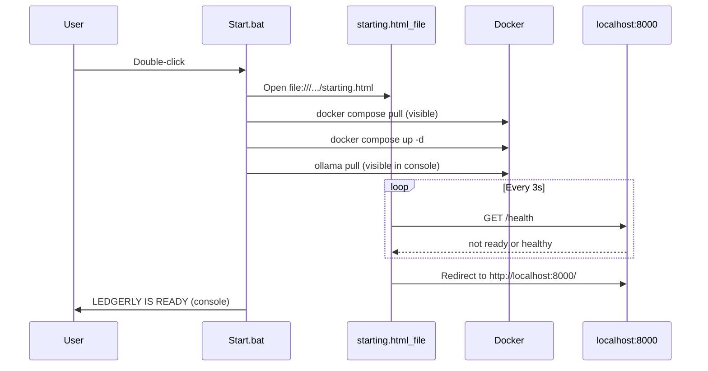

# Startup progress UX (Option A + B)

## Problem

[`Start.bat`](Start.bat) hides most work today: `docker compose up -d` pulls images silently, wait loops suppress output, and the browser only opens at the end—so a 30+ minute first run looks broken.

## Architecture



## 1. Add local [`starting.html`](starting.html) (host filesystem, not container)

Place at **project root** next to `Start.bat` so `%LocalAppData%\Ledgerly\starting.html` exists after `Setup.bat` / robocopy.

**Content (plain, dad-friendly — match [`static/help.html`](static/help.html) styling):**
- Title: “Starting Ledgerly…”
- Prominent note: **First start may take 30+ minutes.** Leave the black Ledgerly window open.
- Client-side elapsed timer (updates every second)
- Status line updated by polling: “Waiting…”, “Still starting (X min) — this is normal”, “Ready — opening Ledgerly”
- Poll `http://localhost:8000/health` every **3 seconds** via `fetch`
- On `"healthy": true`, `window.location.replace('http://localhost:8000/')`
- Graceful failure text if fetch errors persist (e.g. “Still downloading — check the black window for progress”)

**Why root, not `static/`:** The app container is not up during early startup; `file://` must read from the Windows install folder.

## 2. Enable CORS on `/health` (required for file:// polling)

[`app/main.py`](app/main.py) has no CORS middleware today. A `file://` page sends `Origin: null`; browsers block reading `/health` without `Access-Control-Allow-Origin`.

**Minimal change** on the existing endpoint (~line 2870):

```python
@app.get("/health")
def health(response: Response):
    response.headers["Access-Control-Allow-Origin"] = "*"
    ...
```

No broad CORS elsewhere—only `/health` for the startup page.

## 3. Enhance [`Start.bat`](Start.bat)

Restructure into **7 clear steps** (console labels stay `[Step N/7]`):

| Step | Change |
|------|--------|
| 1 | Unchanged prerequisites |
| **Early** | After Docker OK: `start "" "%CD%\starting.html"` (opens local startup page immediately) |
| 2 | **New:** `docker compose pull` — **no output suppression** so image download progress is visible |
| 3 | `docker compose up -d` (rename from old step 2) |
| 4 | Wait for Ollama — keep polling logic, but print **elapsed minutes** every ~30s (e.g. `... still waiting for Ollama (~6 min elapsed)`) instead of only check counts |
| 5 | Model pulls — add **“Model 2 of 3: moondream”** counter; keep `docker compose exec ollama ollama pull` **without** `-T` so pull progress streams to the console |
| 6 | Wait for `/health` — same elapsed-minute messaging; use curl with PowerShell `Invoke-WebRequest` fallback if curl missing |
| 7 | **Remove** duplicate `start http://localhost:8000/` — `starting.html` handles redirect; summary still prints the URL as fallback |

**Subroutines to add:**
- `:elapsed_mins` — derive minutes from wait counter × sleep interval for human-readable console lines
- `:ensure_model` — accept model name + index/total for numbered messages

**Failure path:** If prerequisites fail before opening browser, skip `starting.html`. Summary/`pause` behavior unchanged.

## 4. Documentation updates

[`install-instructions.md`](install-instructions.md):
- **Step 4 (Start Ledgerly):** Browser opens a **“Starting Ledgerly”** page first; it auto-opens the app when ready.
- **How long startup takes:** Cross-link the startup page + black window as the two places to watch progress.

[`installer/README.md`](installer/README.md): One-line note that `starting.html` ships in the portable ZIP.

**Out of scope:** [`start.sh`](start.sh) Mac/Linux parity (can follow later if needed).

## 5. Distribution

- [`Setup.bat`](Setup.bat) / robocopy already copies all root files — no Setup change required beyond docs.
- Rebuild portable ZIP after merge: `python3 installer/build_portable_zip.py`
- For dad’s existing install: copy `starting.html` + updated `Start.bat` into `%LocalAppData%\Ledgerly`, or re-run Setup from a new ZIP.

## Testing checklist

1. **CORS:** Open `starting.html` via `file://`, confirm DevTools Network shows `/health` readable (not CORS-blocked).
2. **Happy path:** `Start.bat` → startup page opens early → console shows `docker compose pull` + model pull lines → page redirects when healthy.
3. **Repeat start:** Second run redirects in ~1–3 min; console shows mostly `[OK] already present`.
4. **No curl:** Windows without curl still reaches ready via PowerShell health check in step 6.
