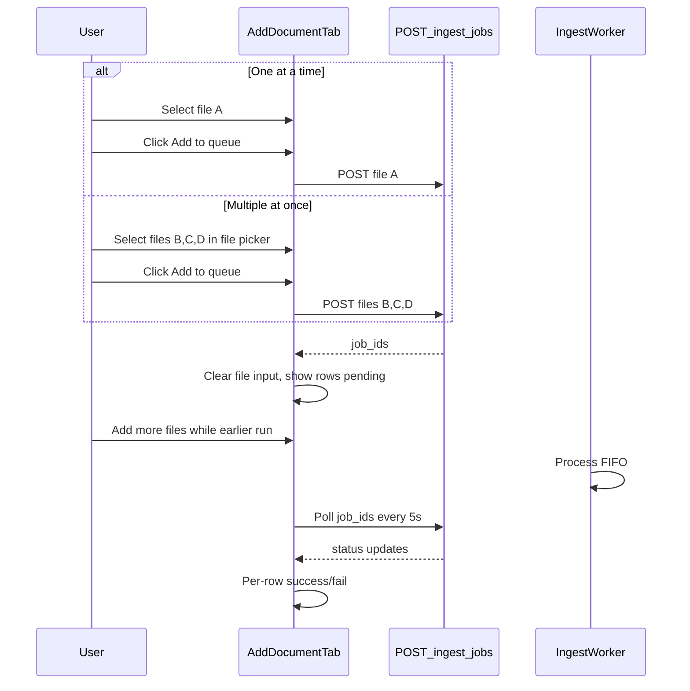

# Upload queue system

## Goal

Let users queue documents (up to ~10 total per session) by clicking **Add to queue** — either one file at a time across multiple picks, or several files at once from the file picker / drag-drop. They can walk away while the server processes them FIFO and see individual success/failure rows at the bottom of the **Add document** tab. If the browser tab closes or the computer shuts down, the queue UI is gone and they must re-select files — no `localStorage`, `sessionStorage`, or reconnect-on-load.

## Current state

- Single file: auto-starts sync `POST /ingest/pdf` or `/ingest/image` immediately on select ([`static/index.html`](static/index.html) `maybeAutoIngestSingleFile()`).
- Multi-file: hidden path — requires opening optional details + submit, batch-posts all files to `POST /ingest/jobs`, blocks the drop zone, polls every 15s, shows one pipe-separated summary line.
- Backend already supports what we need: [`POST /ingest/jobs`](app/main.py) (202 + job IDs), [`GET /ingest/jobs?ids=...`](app/main.py) (poll status), FIFO worker in [`app/ingest_worker.py`](app/ingest_worker.py). **No backend changes required.**

## Target UX



**Per your choices:**
- Manual start only (no auto-ingest on file select)
- **Add to queue** enqueues all currently selected files (1 or many) in one click; user can repeat until session cap (~10)
- Queue panel only on the Add document tab (bottom)

## Implementation (frontend only — [`static/index.html`](static/index.html))

### 1. HTML / copy updates (ingest panel ~L1000–1080)

- Keep **`multiple`** on `#ingest-pdf` so users can pick several files at once from their drive (Cmd/Ctrl+click or Shift+click in the native picker). Drag-drop of multiple files also works via existing `ev.dataTransfer.files`.
- Update drop zone copy: e.g. *"Drop one or more PDFs/images, or click to browse. Then click **Add to queue**. You can add more batches while earlier ones process."*
- Add a always-visible action row below the drop zone:
  - **`#ingest-queue-selection-hint`** — e.g. *"3 files selected"* (hidden when 0)
  - **`#ingest-queue-start`** button — label **"Add to queue"** (append count when >1: *"Add to queue (3)"*); disabled when no files selected, enqueue in flight, or session would exceed cap
  - Short hint: *"Queue is not saved if you close this page — re-select files to try again."*
- Add queue panel below `#ingest-message`:

```html
<div id="ingest-queue-panel" hidden>
  <h3 id="ingest-queue-heading">Upload queue</h3>
  <p id="ingest-queue-summary" class="field-hint"></p>
  <ul id="ingest-queue-list" class="ingest-queue-list"></ul>
</div>
```

- Keep pasted-text flow separate (`#ingest-submit-wrap` + **Ingest** for text only).

### 2. CSS (~L759–843)

Add styles for `.ingest-queue-list`, `.ingest-queue-item` with status variants (`pending`, `running`, `success`, `error`), compact progress text, and per-row Preview/Open actions (reuse existing `.ingest-success-actions-row` / `.home-row-btn` patterns).

### 3. Client-side queue state (in-memory only)

New module-level state in the ingest script block:

```javascript
var ingestQueueSession = {
  items: [],       // { localId, filename, jobId, status, stage, progress_pct, error, result }
  pollTimer: null
};
```

- **No** `localStorage` / `sessionStorage` / `beforeunload` recovery.
- On page load, `ingestQueueSession` is empty; `refreshAskIngestBusyBanner()` may still show server jobs from other sessions — acceptable, but the ingest-tab queue panel only tracks jobs started in this session.

### 4. Remove auto-ingest; wire manual queue

| Remove / change | Replacement |
|-----------------|-------------|
| `maybeAutoIngestSingleFile()` and its `change` handler call | Update selection hint + enable **Add to queue** when `files.length >= 1` |
| `ingestBusy` blocking file input & drop zone during batch | Only disable **Add to queue** briefly while enqueue request is in flight; drop zone stays usable |
| Old multi-file branch in `runIngestFromForm()` (auto poll + pipe summary) | Replace with shared queue session logic below |
| Sync `POST /ingest/pdf` and `/ingest/image` for file uploads | Always `POST /ingest/jobs` with one `file` part per selected file |

New functions (names illustrative):

- **`enqueueSelectedFiles()`** — validate `files.length >= 1`, no pasted text; enforce session cap (`INGEST_QUEUE_MAX - items.length`); build `FormData` appending each selected file; optional shared fields (tags, account_id) apply to all files in the batch — do **not** pass shared `doc_id`/`title` when batch size > 1; `POST /ingest/jobs`; on 202 map returned `jobs[]` to new `ingestQueueSession.items`, clear `#ingest-pdf` + source default, show queue panel, start poll.
- **`updateIngestQueueSelectionUi()`** — on file `change`/drop, show *"N files selected"* and button label with count.
- **`renderIngestQueuePanel()`** — rebuild `#ingest-queue-list` rows from session state.
- **`pollIngestQueue()`** — `GET /ingest/jobs?ids=...` every **5s** (faster than today's 15s); update each row's status/stage/progress; on terminal states call `loadDashboard()` once per newly finished success; stop timer when all session jobs are `success` or `failed`.
- **`formatQueueItemRow(item)`** — pending: *"waiting"*; running: *"stage · N%"*; success: green row + `appendDocumentOriginalActions()`; failed: red row + error text.

Wire `#ingest-queue-start` click → `enqueueSelectedFiles()`.

Soft cap: `INGEST_QUEUE_MAX = 10` applies to **total queued items in the session** (not per batch). If 7 are already queued and user selects 5, allow only 3 and show: *"Queue holds up to 10 files — only 3 more can be added."* Disable button when session is full.

### 5. Per-file completion messages (bottom of ingest tab)

- `#ingest-message` — use only for immediate errors (validation, enqueue failed, poll network error).
- `#ingest-queue-panel` — persistent per-file outcomes:
  - While running: summary like *"Processing 2 of 5 — 1 done, 1 failed so far"*
  - When all done: *"Finished — 8 succeeded, 2 failed"* with each file on its own row (not a single pipe-separated line).
- Each success row gets Preview/Open via existing [`appendDocumentOriginalActions`](static/index.html); optional single **Go to Home** button if any result has trackable dates (reuse `getHomeFollowUpTargetFromResults`).

### 6. Pasted text unchanged

`runIngestFromForm()` on form submit continues to handle text-only ingest via `POST /ingest` (sync). File queue does not mix with pasted text (existing mutual-exclusion check stays).

### 7. Optional help copy

Update [`static/help.html`](static/help.html) one line if it still says single-file auto-ingest works best.

## Out of scope

- Server-side queue persistence across restarts (already in-memory; matches your requirement).
- Reconnecting to in-flight server jobs after page reload.
- Global/sticky queue bar on other tabs.

## Manual test plan

1. **One at a time:** select file A → **Add to queue** → row appears; file input clears.
2. **Multiple at once:** Cmd/Ctrl-select 4 files in picker → shows *"4 files selected"* → **Add to queue (4)** → 4 rows appear; input clears.
3. **Mixed batches:** queue 3 files, then while they run select 2 more → **Add to queue** → 5 total rows; drop zone never locks.
4. Switch to Ask/Home and back — queue panel still visible on Add document tab with live updates.
5. When each finishes, row shows success (Preview works) or failure with error.
6. Session cap: queue 8, then try to add 5 — only 2 accepted with clear message; 11th total blocked.
7. Refresh page mid-queue — panel empty; re-select files to start over (server may still finish old jobs, but UI does not resume them).
8. Pasted text → **Ingest** still works; cannot combine with files in the picker.

## Files to change

| File | Change |
|------|--------|
| [`static/index.html`](static/index.html) | Queue UI, CSS, JS refactor (primary work) |
| [`static/help.html`](static/help.html) | Minor copy tweak (optional) |

No Python/backend changes unless manual testing reveals a gap in single-file `POST /ingest/jobs` responses.
