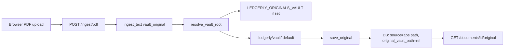

# Zero-config upload preview

## Problem

Browser PDF uploads store only the **filename** in `documents.source` (e.g. `statement.pdf`). Preview requires a resolvable absolute path or a vault copy, but [`app/originals_vault.py`](app/originals_vault.py) is a stub — `save_original` does not exist and `vault_enabled()` only checks `LEDGERLY_ORIGINALS_VAULT`. Ingest succeeds but `has_openable_original` is always `false` for uploads.

## Solution

Always persist upload bytes to a **default app-local vault** when no env vault is configured. No user setup required.



**Resolution order for vault root** (env still wins when set):

1. `LEDGERLY_ORIGINALS_VAULT` from env (existing behavior for Docker/power users)
2. Else `{project_cwd}/.ledgerly/vault` — created automatically on first save

`.ledgerly/` is already gitignored.

## Implementation

### 1. Implement [`app/originals_vault.py`](app/originals_vault.py)

Replace the stub with real I/O (~120 lines). Required functions already called from [`app/main.py`](app/main.py):

| Function | Behavior |
|----------|----------|
| `resolve_vault_root()` | Delegate to `vault_settings_store.resolve_vault_root()` |
| `vault_enabled()` | `bool(resolve_vault_root())` — true by default once default root exists |
| `vault_root()` | Return resolved `Path` |
| `originals_dir()` / `incoming_dir()` / `pending_dir()` | `{root}/originals`, `{root}/incoming`, `{root}/pending` |
| `ensure_vault_layout()` | `mkdir -p` for those dirs |
| `vault_writable()` | Probe write in `originals/` |
| `absolute_from_vault_relative(rel)` | `{vault_root}/{rel}` |
| `save_original(doc_id, filename, bytes)` | Write to `originals/{doc_id}/{safe_filename}`; return `(rel_path, abs_path)` |
| `save_text_snapshot(doc_id, utf8_bytes)` | Write `originals/{doc_id}/extracted.txt` when `VAULT_SAVE_TEXT_INGEST` |

**Save layout:** `originals/{doc_id}/{sanitized_original_filename}` — matches existing ingest call site:

```523:530:app/main.py
    elif originals_vault_mod.vault_enabled() and vault_original is not None:
        rel, abs_saved = originals_vault_mod.save_original(
            doc_id, vault_original[0], vault_original[1]
        )
        if rel is not None:
            stored_vault_rel = rel
        if abs_saved is not None:
            effective_source = str(abs_saved)
```

**Error handling:** If write fails, log a warning and continue ingest (same as `VAULT_INGEST_REQUIRE_WRITE=false` default). Preview won't appear for that doc, but text/RAG still works.

**Filename sanitization:** Strip path components from browser filename; reject empty/`..` names; fallback to `upload.pdf` / `upload.bin`.

### 2. Update [`app/vault_settings_store.py`](app/vault_settings_store.py)

Minimal change — only what zero-config needs:

- Add `DEFAULT_VAULT_REL = ".ledgerly/vault"`
- `resolve_vault_root()`: return env path if set, else absolute path to `{cwd}/.ledgerly/vault`
- `effective_vault_root_source()`: return `"env"` or `"default"`
- `vault_root_is_from_env()`: return `bool(LEDGERLY_ORIGINALS_VAULT)`
- Leave `write_vault_settings_file` / `file_settings_snapshot` as no-ops for now (Watched library UI stays disabled until a follow-up)

No `.ledgerly/vault_settings.json` read/write in this scope.

### 3. Fix [`app/vault_path_validation.py`](app/vault_path_validation.py)

Return a small dataclass/named tuple matching what callers expect (`.valid`, `.resolved_root`, `.originals_dir`, etc.) so `/vault/settings/verify-root` doesn't break if exercised later. Not required for zero-config preview, but prevents latent API errors.

### 4. UI copy tweak in [`static/index.html`](static/index.html)

Small updates so users aren't told they must configure vault or paste paths:

- Ingest source hint (~L1032): note that browser uploads are auto-saved for Preview; pasting a path is optional (for files not uploaded through the app).
- Vault status panel (~L1068): when `root_source === "default"`, show something like "Using built-in storage at `.ledgerly/vault`" instead of "not loaded".
- Watched library notice: clarify that env vault and Watched library are **optional** power-user features; uploads preview without them.

No new endpoints or frontend preview logic — existing `appendDocumentOriginalActions` and `GET /documents/{id}/original` already work once `has_openable_original: true`.

### 5. Tests

Add [`tests/test_ingest_vault_default.py`](tests/test_ingest_vault_default.py) (or extend existing ingest tests):

- POST `/ingest/pdf` with a small PDF fixture (or mock bytes + monkeypatch extraction)
- Assert response `has_openable_original is True`
- Assert `source` is an absolute path under `.ledgerly/vault/originals/`
- Assert file exists on disk
- Assert `GET /documents` list row has Preview-eligible metadata
- Assert env override: when `LEDGERLY_ORIGINALS_VAULT` is set in test, files land under that path instead

Reuse patterns from [`tests/test_documents_list.py`](tests/test_documents_list.py) for `has_openable_original` assertions.

## Out of scope (follow-ups)

- **Watched library UI** — requires `vault_settings_store` persistence, `vault_watcher.py`, `vault_pathutil.py` (currently missing modules)
- **Retroactive preview** for docs already ingested with filename-only source — user must re-ingest or paste path in Edit
- **Docker persistence** — document that `.ledgerly/vault` should be volume-mounted in containers (same class of concern as `ledgerly.db`)

## Verification checklist

1. Unset `LEDGERLY_ORIGINALS_VAULT` in `.env`; restart server
2. Ingest tab → upload a PDF (no Source path pasted)
3. Documents tab → row shows **Vault copy** populated; Actions column has **Preview** + **Open**
4. Preview opens PDF in new browser tab at `http://127.0.0.1:8000`
5. Confirm `.ledgerly/vault/originals/{doc_id}/` exists on disk
