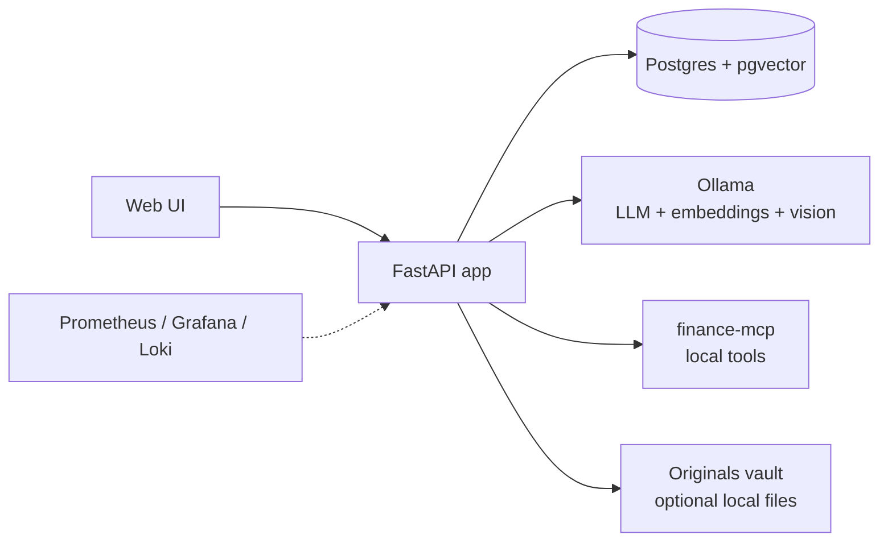

# Ledgerly

**Private cash and document assistant** — track CD ladders and obligations, ingest financial PDFs, and ask questions over your own data. Runs entirely on your machine; documents never leave your PC unless you configure optional telemetry.

> **Repo note:** This project folder may be named `Finelly` locally; the product name is **Ledgerly**.

---

## Highlights

- **Structured finance data + RAG** — Accounts, positions, and obligations are the source of truth; ingested documents verify and enrich them.
- **Trigger-based guidance** — Surfaces actionable memos when CDs mature or bills come due; otherwise reports *No action required*.
- **Local-first AI** — Ollama for LLM, embeddings, and vision (OCR fallback for scans). No cloud API required for core Ask and ingest.
- **Production-minded ops** — Docker Compose stack, portable Windows installer, background ingest/ask queues, Prometheus/Grafana/Loki observability, and CPU/thermal tuning for real laptops.
- **LangGraph Ask pipeline** — Routes questions through classification, optional finance tools (compound interest, liquidity cross-check, roll options), retrieval, and reranking.

See [FINANCIAL-ASSISTANT.md](FINANCIAL-ASSISTANT.md) for product principles and scope boundaries (CD ladder / safe cash — not a trading or portfolio optimizer).

---

## Architecture



| Layer | Tech |
|-------|------|
| API & UI | FastAPI, static HTML/JS, Pydantic |
| Retrieval | pgvector (Postgres) or SQLite fallback |
| Ask routing | LangGraph, local finance tools, optional reranker |
| Models | Ollama — `qwen3:8b`, `nomic-embed-text`, vision per profile |
| Deploy | Docker Compose, portable Windows ZIP (`installer/`) |
| Observability | Prometheus metrics, Grafana dashboards, Loki logs (`docker compose --profile observability up -d`) |

More detail: [overview.md](overview.md)

---

## Quick start

**Prerequisites:** [Docker Desktop](https://www.docker.com/products/docker-desktop/)

From the repo root (folder with `docker-compose.yml`):

- **Mac / Linux:** `./start.sh`
- **Windows:** `Start.bat`

The launcher starts containers, waits for Ollama, **pulls required models** (one-time), then opens **http://localhost:8000/** when ready.

First run downloads container images and Ollama models (several GB) — often 15–45+ minutes on a home connection. Later starts are typically 1–3 minutes. See [install-instructions.md](install-instructions.md) for timing expectations and the portable Windows path.

<details>
<summary>Manual Docker (no launcher script)</summary>

```bash
docker compose up -d
docker compose exec ollama ollama pull qwen3:8b
docker compose exec ollama ollama pull nomic-embed-text
docker compose exec ollama ollama pull llava:7b
```

Then open **http://localhost:8000/**. Without the model pulls, Ask and ingest will fail until Ollama has those models.

</details>

**Native dev** (no Docker): Python 3, local Ollama, `pip install -r requirements.txt`, copy [.env.example](.env.example) → `.env`, then `uvicorn app.main:app --reload`. Full steps in [setup_and_testing.md](setup_and_testing.md).

---

## Try the demo flow

After the app is up, [setup_and_testing.md](setup_and_testing.md) includes a **Real data pack** — paste sample CD and bill notices, enter ladder data, then run Ask questions like *"Do I need the July 2 CD rung to stay liquid for my property tax on July 5?"*

Sample document text: [docs/sample-cd-maturity-letter.md](docs/sample-cd-maturity-letter.md), [docs/sample-bill-reminder.md](docs/sample-bill-reminder.md)

---

## Tests

```bash
python3 -m venv .venv
source .venv/bin/activate   # Windows: .venv\Scripts\activate
pip install -r requirements.txt -r requirements-dev.txt
pytest -q
```

Manual API and Ask-tab walkthroughs: [test_plan.md](test_plan.md), [docs/decision-status-test-guide.md](docs/decision-status-test-guide.md)

---

## What works today

| Area | Status |
|------|--------|
| Document ingest (PDF, image, paste, multi-file queue) | ✅ |
| RAG Ask + streaming, history, preset chips | ✅ |
| Structured data (accounts, positions, obligations, IRA overview) | ✅ |
| Trigger engine + decision memos | ✅ |
| Local finance tools (interest calc, liquidity cross-check, roll options) | ✅ |
| Docker + portable Windows installer | ✅ |
| Observability stack (metrics, dashboards, structured ask traces) | ✅ (optional `--profile observability`) |
| Optional Finnhub quotes via finance-mcp | ✅ (needs `FINNHUB_API_KEY`) |

**Roadmap:** API auth for exposed deployments, response caching, deeper empty states when optional services are offline. See [overview.md](overview.md).

---

## Design tradeoffs

- **No hosted demo** — Financial documents stay local by design. Clone and run, or use the copy-paste demo data above.
- **CPU and thermals** — Local LLM inference in Docker can run warm on laptops. Use `LEDGERLY_PROFILE=portable`, lower `OLLAMA_NUM_THREADS`, and queued Ask to prioritize quiet operation over speed. Details: [docs/target-pc-dad-xps15.md](docs/target-pc-dad-xps15.md), [.env.portable-xps15.example](.env.portable-xps15.example).
- **In-memory job queues** — Background ingest/ask queues do not survive a server restart (by design for simplicity).

---

## Documentation

| Audience | Start here |
|----------|------------|
| Quick look / architecture | This file, [overview.md](overview.md) |
| Developers | [setup_and_testing.md](setup_and_testing.md), [.env.example](.env.example) |
| End users (Windows portable) | [install-instructions.md](install-instructions.md), [installer/README.md](installer/README.md) |
| Product & privacy | [FINANCIAL-ASSISTANT.md](FINANCIAL-ASSISTANT.md) |
| In-app help | [static/help.html](static/help.html) |
| Supabase remote logging (optional) | [supabase/README.md](supabase/README.md) |

---

## Upgrading from an older install

If you installed Ledgerly when Docker Postgres used the old `finelly` credentials, back up first, then reset the database volume:

```bash
# Back up with old credentials (only if the old stack still runs):
docker compose exec -T postgres pg_dump -U finelly -d finelly -Fc -f /tmp/ledgerly-backup.dump
docker compose cp postgres:/tmp/ledgerly-backup.dump ./ledgerly-backup.dump

# Reset volume and start fresh with ledgerly credentials:
docker compose down -v
docker compose up -d

# Optional restore into the new database:
docker compose cp ./ledgerly-backup.dump postgres:/tmp/ledgerly-restore.dump
docker compose exec -T postgres pg_restore -U ledgerly -d ledgerly --clean --if-exists /tmp/ledgerly-restore.dump
```

Portable Windows backup steps: [install-instructions.md](install-instructions.md)
