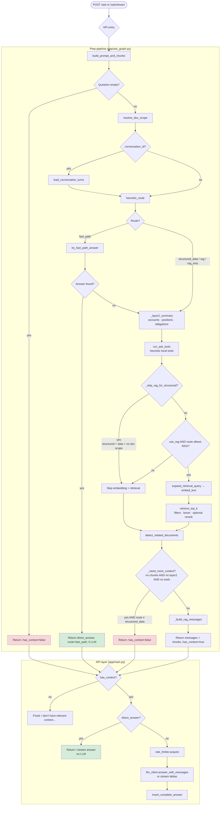
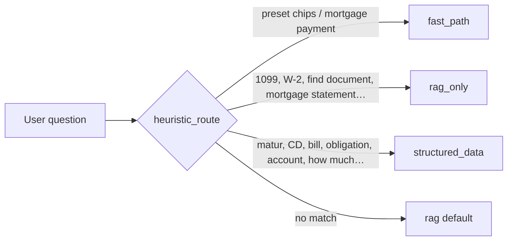
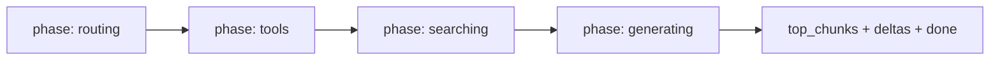
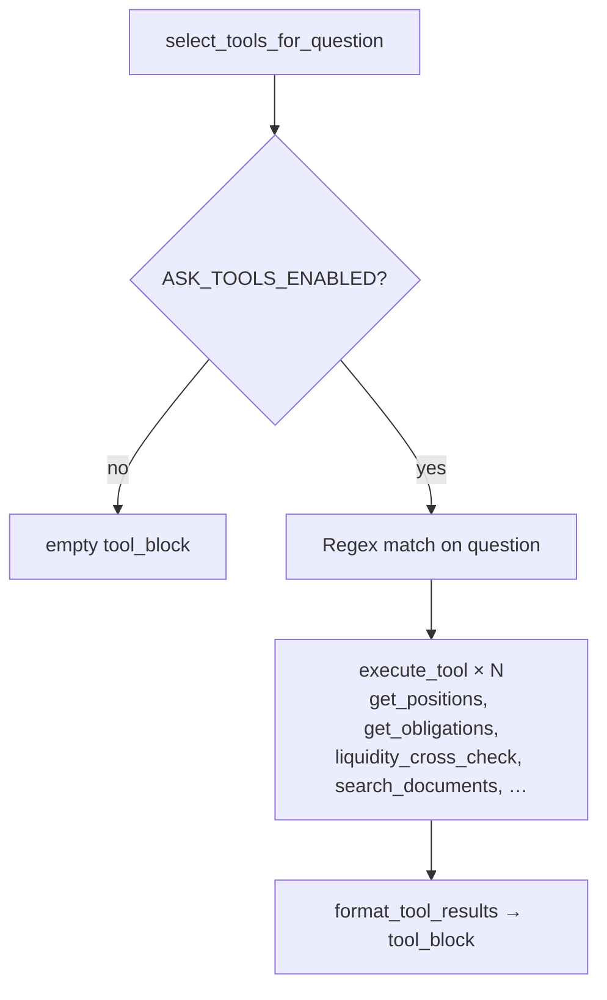
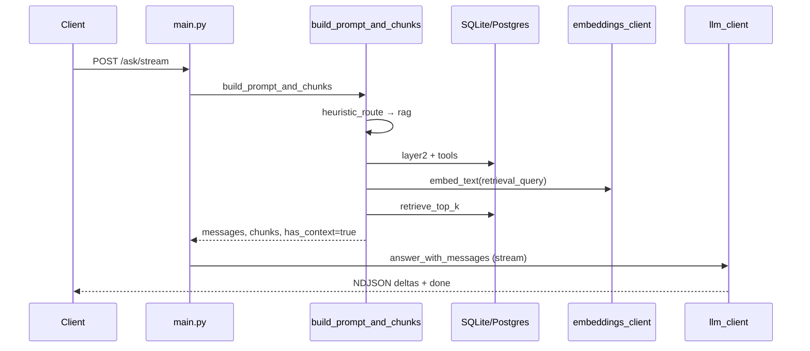

# Current Ask Pipeline (State-Style Flow)

**Ledgerly / Finelly** — Ask orchestration as implemented in `app/ask_graph.py` and `app/main.py`.

> **Note:** Despite the filename `ask_graph.py` and `langgraph` in `requirements.txt`, the codebase **does not currently use LangGraph's `StateGraph` API**. The pipeline is a sequential async function (`build_prompt_and_chunks`) plus API branching in `main.py`.

---

## Main flow

---

## Routing (`heuristic_route`)

| Route | Typical intent | Retrieval | Tools / layer2 |
|-------|----------------|-----------|----------------|
| `fast_path` | Preset questions, mortgage payment math | Skipped if answer found | Skipped on early exit |
| `rag_only` | Document search / tax forms | Yes (if `use_rag`) | Yes |
| `structured_data` | CDs, bills, accounts, summaries | Often skipped when DB/tools suffice | Yes |
| `rag` | General fallback | Yes (if `use_rag`) | Yes |

---

## Streaming progress phases (`/ask/stream`)

Fast-path and no-context exits skip the LLM `generating` phase.

---

## Tool subgraph (`run_ask_tools`)

Tools are **local DB / finance logic only** — no external MCP calls in this router.

---

## End-to-end sequence (typical RAG path)

---

## Conceptual state shape (not LangGraph)

| Field | Set by |
|-------|--------|
| `question`, `scoped_request`, `prior_turns` | Input + conversation |
| `route` | `heuristic_route` |
| `direct_answer` | `try_fast_path_answer` |
| `layer2`, `tool_block`, `tool_results` | DB summary + tools |
| `top_chunks` | Retrieval |
| `related_documents` | `detect_related_documents` |
| `messages`, `has_context` | Prompt build / gates |

There is no shared mutable graph state object today — each step uses local variables inside `build_prompt_and_chunks`.

---

## Key source files

| File | Role |
|------|------|
| `app/ask_graph.py` | Prep pipeline: routing, fast paths, retrieval gate, prompt build |
| `app/main.py` | `/ask`, `/ask/stream` — LLM call, streaming, history |
| `app/ask_tool_router.py` | Heuristic tool selection and execution |
| `app/ask_fast_paths.py` | Deterministic preset answers (0 LLM) |
| `app/ask_conversation.py` | Doc scope inheritance, prior turns, retrieval query expansion |
| `app/retrieval.py` | Vector search, optional rerank, retrieval boost |
